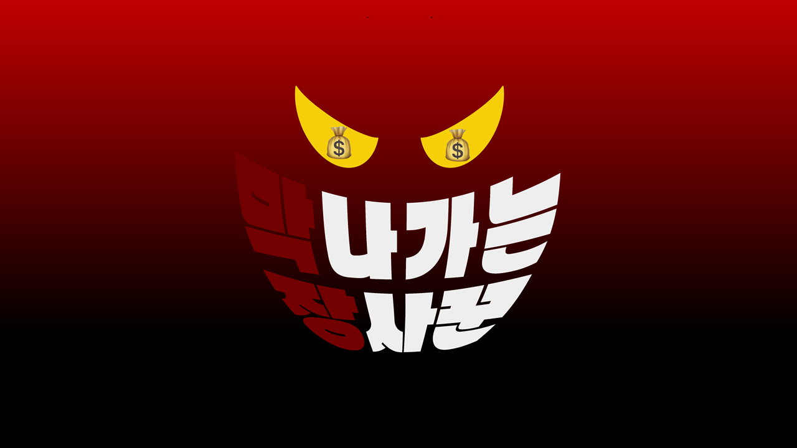
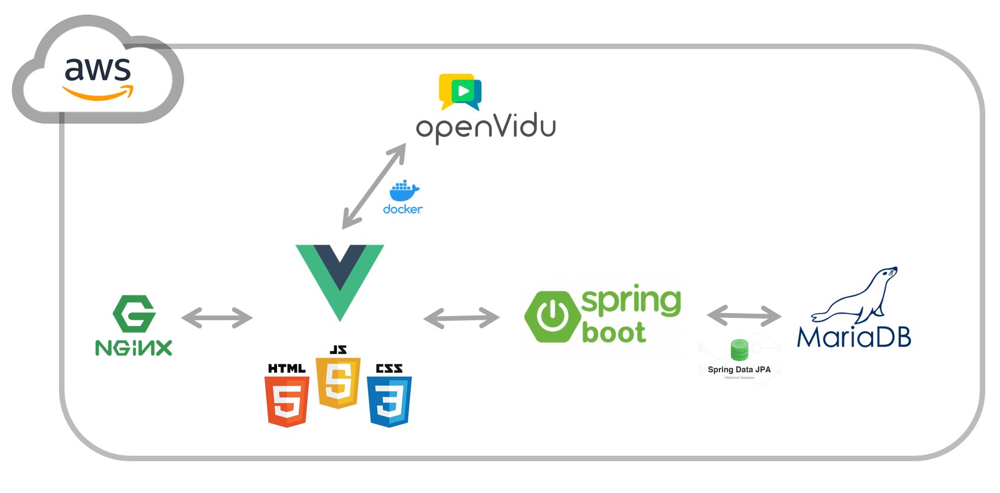
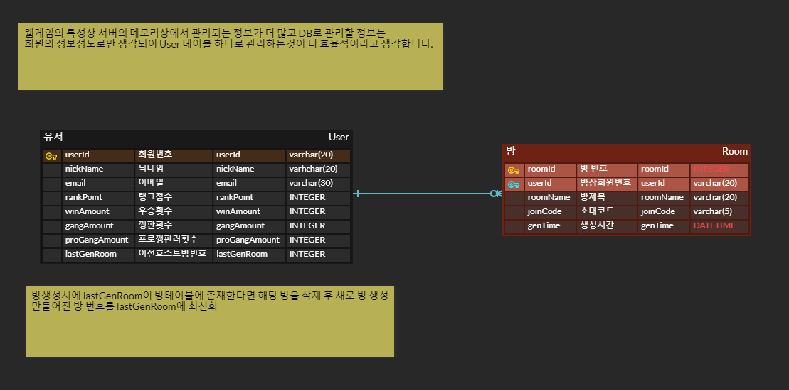
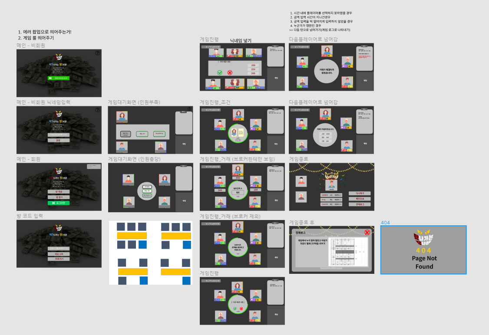

## 막나가는 장사꾼 🕹 (화상 보드 게임 서비스)

- WebRTC 기반 화상 보드 게임 서비스
- 개발 기간: 2022.01.10 ~ 2022.02.18

## 📢 목차

1. 웹 서비스 소개
2. 게임 룰 소개
3. 기술 스택/개발 환경
4. 서비스 아키텍처
5. ERD & 와이어프레임
6. 협업 툴
7. Git 컨벤션
8. Git Flow 브랜치 전략
9. EC2 포트 정리
10. 팀원 소개 및 역할
12. 협업 후기

## 🌐 웹 서비스 소개

### 기획 배경

- 사용자도 재밌고! 개발자도 재밌는! 그런 프로젝트가 없을까?!
- COVID-19로 인하여 친구들도 만나기 어려운 요즘! 변한건 없니 친구야??
- 개발자들끼리도 처음 만났지만 이렇게 친해졌다! 처음 만난 사람들과 업무 및 학업을 진행해야하는데 너무 어색하다? 아이스브레이킹으로 이만한게 없다구!!
- 막나가는 장사꾼(이하 막장)은 온라인으로 보드게임을 즐길 수 있는 **화상 기반 웹 게임**입니다.
- 사회자의 역할을 서버에게 맡기고 온전히 게임과 함께하는 유저에게 집중하세요!
- `필요한` 능력이 있는 유저에게 말을 걸 수 밖에 없을걸요?

## 🧩 게임 Rule

### 게임 전

게임인원: 4인 ~ 6인

게임 참가 방법: 게임 코드가 있어야 참가가 가능합니다.

라운드: 3라운드

보유금액: 5천만원

거래금액 : 라운드가 진행될수록 제시되는 거래금액은 더 커집니다.

### 게임 시작

A. 능력 분배

 6개의 능력 `창고`, `인맥`, `언변`, `정보`, `로비`, `선박` 중 2가지 능력을 매 라운드 마다 부여받게 됩니다.

B. 거래 단계

 한 라운드 당 각 플레이어는 `브로커`가 됩니다. 브로커는 주어진 정보를 통해 조건을 만족하는 능력을 가진 플레이어들을 선택하여 정해진 금액을 적절하게 분배해야합니다.

 선택받은 플레이어는 거래 참가 여부를 선택할 수 있습니다.

 한 명이라도 거래를 거부한다면 해당 거래는 실패하게 됩니다. 이때, 한 명만 배신한다면 이득을 얻을 수 있지만 2명 이상 거부했다면 패널티가 부과됩니다.

 마치 거래에 참가할 것처럼 속이고 들어가서 해당 거래를 무효로 만들어버릴 수도 있겠죠?

C. 순위 발표

 매 라운드가 끝이 나면 순위를 발표합니다. 모든 게임이 종료되기 전까지 각 플레이어의 보유 금액은 비공개입니다.

 이전 라운드에서 순위가 높은 플레이어부터 다음 라운드의 브로커가 되어 게임을 진행하게 됩니다. 

## 💻 기술 스택 및 개발 환경

#### 🎨 **프론트엔드**

- HTML
- CSS
- JS
- Vue
  - Vue 3
  - Vuex
  - Vue-router
  - Vuebootstrap3
- OpenVidu

#### 👨🏻‍🦲 백엔드

- Java
- Spring boot
- Stomp
- WebRTC
- MariaDB
- JPA

#### ⚙ 배포

- Nginx
- Docker
- AWS

## 🧱 서비스 아키텍쳐

## 🧩 ERD & 와이어프레임

### ERD

### 와이어프레임

## 🗣 협업 툴

- Git
- SourceTree
- Jira
- Notion
- Mattermost
- Webex

## 🌳 Git Flow 브랜치 전략

- Git Flow 사용 브랜치

  - master
  - release
  - develop
  - front-end
  - back-end
  - readme
  - 각자 이름의 브랜치

- Git Flow 진행 방식

  - front, back 하위의 feature 브랜치가 완성되면 merge
  - 매 주 master 브랜치로 merge
  - 매일 자신의 이름의 브랜치로 readme merge

- feature 브랜치 이름 규칙

  - front-end or back-end/[기능이름]

  

### 🌐 EC2 포트 정리

| PORT | 이름                                                  |
| ---- | ----------------------------------------------------- |
| 443  | HTTPS                                                 |
| 80   | HTTP - HTTPS로 리다이렉트(프론트 페이지로 리다이렉트) |
| 5443 | Openvidu                                              |
| 3306 | MySQL                                                 |
| 8080 | Spring boot Docker Container                          |
| 3000 | NginX Docker Container                                |

## 👥개발 팀 소개

#### 채은 : FE, 전체 팀장

> FE 팀과 함께 FE개발을 합니다. 또한 팀 전체를 관리합니다.
>
> - 8팀 얼굴 담당 🥺

#### 승수 : BE, BE팀장, 전체 부팀장

> BE 팀원을 통솔하고 BE관련 전체 책임자 역할을 맡습니다. 또한 팀장 부재시 부팀장으로 역할을 수행합니다.
>
> + AWS 서버 및 WebRTC 환경구축
> + Back-End 서버 구현
> + 8팀 웃음 담당 😎

#### 수용 : BE, 게임 총괄 팀장

> BE 팀장과 함께 게임 서비스 전체를 관리합니다. 또한 게임 룰이나 컨텐츠에 대한 부분을 관리합니다.
>
> - 8팀 빡빡이 담당 👨🏻‍🦲

#### 주호 : FS, 배포 팀장

> 풀스택으로 BE와 FE를 오가며 전반적인 코드 컴포넌트를 관리합니다.
>
> - 8팀 숭구리당당 👶

#### 가은 : FE, PM

> FE 팀과 함께 FE 개발을 합니다. 프로젝트 전체 일정을 관리하고 Jira, notion등을 관리합니다.
>
> - 8팀 불한당 👺

#### 소영 : FE, FE 팀장

> FE 팀원을 통솔하고 FE관련 전체 책임자 역할을 맡습니다.
>
> - 8팀 성심당 🍞

## 🤝 협업 후기

### 한채은

- 팀원 케미 100%! 좋은 팀원들을 만나 재밌게 작업했다. 안되는건 같이 머리써가면서 풀어나갔다. 팀원들에게 많이 배웠고, 나도 많이 성장할 수 있었다! 🙏 다음 프로젝트 때는 문서화를 좀 더 잘 해서 어떤 이슈가 있었고, 어떻게 해결했는지를 더 자세하게 기록해야겠다고 생각했다!

  

### 이가은

- **처음 만난 사람들과 6주간 프로젝트를 진행하는 것에 대하여, 과연 내가 팀에 기여할 수 있는 부분은 무엇일지에 대한 걱정부터 어떤 팀원 분들을 만나게 될 지 기대감까지 팀빌딩을 하며 많은 감정들이 생겼습니다.**
- 하지만 본인의 생각을 잘 이야기하고, 다른 팀원 분들의 의견을 존중하며 프로젝트가 끝나고 "아! 그때 진짜 재밌게 알찬 프로젝트 했었어!"라고 기억이 남았으면 좋겠다는 생각이 비슷했습니다.
- 6주라는 시간동안, 많은 것을 배울 수 있었고 이렇게까지 좋은 팀원을 다음에도 만날 수 있을까?라는 생각이 들었습니다.
- 팀원 한 명 한 명 모두들 너무나 큰 역할들을 이번 프로젝트에서 맡아주셔서 너무나 감사드립니다🤗

### 이소영

+ **"다시 만나고 싶은 팀원들, 기억에 남을 프로젝트"**
+ 2학기를 시작하며 새로운 팀원들과 함께 새로운 기술들을 이용해야하는 환경이 어색하기만 했었는데, 8팀 팀원들 모두 밝고 좋은 분들이라서 너무 재미있게 진행했던 프로젝트였습니다. 
+ 이번 프로젝트 통해서 많은 것들 배우는 뜻깊은 시간을 보내서 너무 좋았고  프로젝트 기간동안 많이 부족한 저를 도와주신 팀원들 모두 감사드립니다 :happy:

### 김주호

- **6주는 짧다, 하지만 팀원들과 함께한 시간은 영원히 머릿속에 남을 것이다.**
- 1학기때 배웠으나 잘 다루지 못했던 `Vue`, 배워본 적 없던 `Java SpringBoot`를 공부하고 싶어 풀스택을 지원하게 되었습니다.
- `Jpa`를 사용하여 back skeleton 코드를, `vue3`에 `vuebootstrap3`와 `vuex`, `router`를 활용하여 front skeleton 코드를 작성한 후 네이버 로그인을 비롯한 여러 기능들을 배우고 추가시켰습니다.
- 그동안 알지 못 했던 많은 것들을 배우고 욕심내는 동안, 팀원들은 저를 응원해주고 믿어주었습니다. 덕분에 잘 마무리할 수 있었다고 생각합니다.
- 서로 웃으며 작업할 수 있어 행복했습니다. **빡빡이들이여, 영원하라!**

### 김승수

- **SSAFY 2학기**의 첫 프로젝트인 공통 프로젝트를 시작하기 전부터 누구와 팀이 될지 걱정 반, 기대 반 이었습니다. 하지만 8팀을 만나고 걱정을 차지하던 마음 한켠이 전부 기대로 바뀌어, 6주간의 모든 일정이 설레게 되었습니다. 첫만남에서부터 같이 보드게임을 하고 애드립을 주고 받으며 어색함이라고는 1도 없었던 우리팀을 만나 너무 재밌었고 어려운 문제가 생기면 서로 고민하고 회의하여 풀어나가는 모습을 보며 다시 한번 모여 프로젝트를 하고 싶다는 생각을 하게 되었습니다. 8팀 모두 남은 기간 화이팅해서 좋은 결과를 얻으면 좋겠습니다. 화이팅❗❗❗

### 김수용

- WebRTC를 활용한 게임 서비스를 기획하며 즐거웠던 마음과 달리, 실제 게임 서비스를 설계하고 구현하며 '정말 복잡하다'라는 생각을 갖게 되었습니다. 한 번도 경험해보지 못한 환경에서, 한 번도 구현해본 적 없는 서비스를 게임으로 제공하고자 했던 것이 그 이유였습니다. 그래도 서로서로 도와주는 멋진 팀원들과 함께 조금씩 걸음을 떼어 만족스러운 프로젝트를 배포할 수 있게 되었습니다. 산출물로 나온 것을 보니 눈물이 앞을 가리지만, 일정상 못다한 버그 픽스 및 리팩토링을 생각해 봐야겠습니다. 팀원들 한 명도 빠짐없이 다들 정말 고생하셨습니다!! 👍

