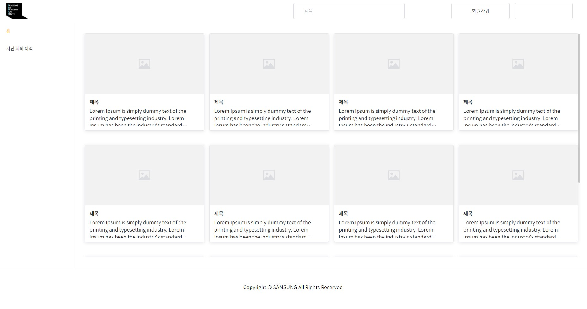
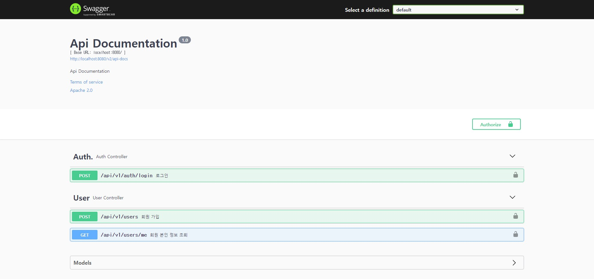

22.01.11

## 프로젝트 환경 설정 - 백엔드

---

### 버전

- java 개발환경 : julu 1.8
- DB : MySQL 8.0
- IDE : IntelliJ IDEA Community Edition 2021.3.1
- Spring : Spring Tools 3.9.14

### 설치

- Lombok : Getter, Setter 등의 \*_보일러플레이트 코드_ 를 줄이기 위해 사용하는 라이브러리  
   \*보일러플레이트 코드 : 재사용가능한 프로그램 또는 코드
- 인코딩 설정 : UTF-8로 통일
- Gradle : Gradle project로 설정, Gradle Task 및 Dependencies 동기화

### 프로젝트 실행

- Gradle 탭의 Tasks-application-bootRun 더블 클릭
- http://localhost:8080 접속

  > 

- Swagger UI 실행 : http://localhost:8080/swagger-ui/ 접속
  
  > 
