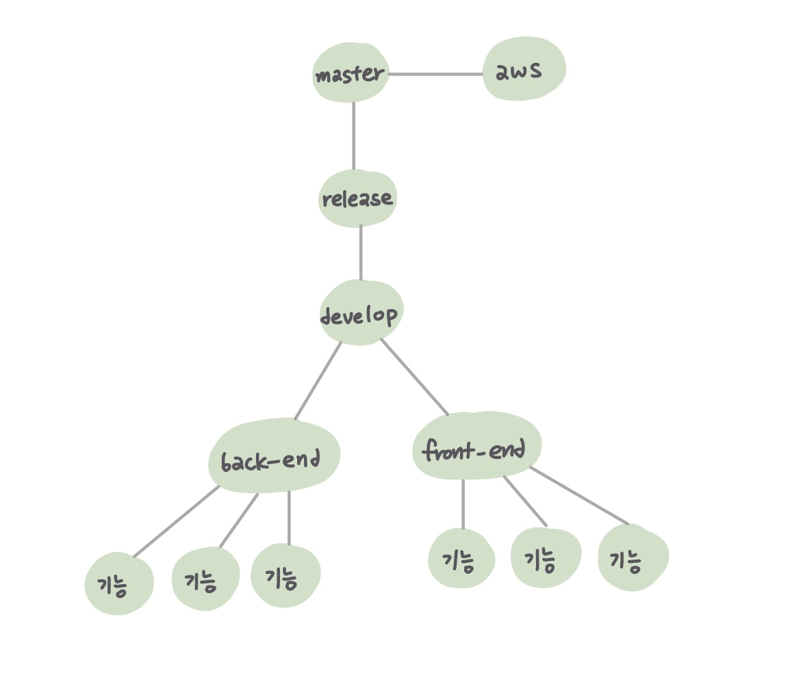

22.01.12

## git branch & Jira 환경

---

### 개요

- 온라인 협업에 필요한 기본 설정을 위해 git branch와 jira 의 개념을 다짐

### git branch

- branch를 나누는 이유 - 프로젝트의 다양한 형상을 관리하기 위함
   - 프로젝트의 기능을 개발할 때 다른 사람들과의 **충돌 및 혼선을 방지**
   - 기능 개발이 완료되어 merge할 때 tree형식을 통해 **가이드라인 제시**
   - 미완성 버전의 프로젝트를 배포함과 동시에 다음 개발을 진행해나가는 **프로토타입 모델** 방식 활용 가능

- *master* branch에는 에러가 없는 최종 프로젝트를 올릴 예정이므로 하위 branch *develop*을 생성
- RESTful한 서비스 개발을 위해 Vue.js를 활용하는  *Front-end*와 Spring & DB를 활용하는 *Back-end*로 구분함
- 이후, 필요한 기능 별로 말단 branch를 생성하여 각자 작업하고 합칠 수 있는 개발환경을 마련

>  

### Jira

 * Jira의 필요성
   * **버그 추적, 이슈 추적, 프로젝트 관리** 기능을 제공
   * git 만으로는 자신과 팀원들의 프로젝트 내 업무 및 책임을 공유하고 관리하기 어려움
   * 이슈별, 기능별 task를 작성하고 이를 해결해나가는 과정을 통해 프로젝트를 체계적으로 관리
 * 설계 및 개발 단계에서 적극적으로 활용 가능
 * 사용법을 익히기 위해 매일 해당 날짜의 `README 작성`  *task*를 생성하고, 팀원별로 *sub task*를 생성 및 완료하는 프로세스 채택

> 

## 화면 설계

### 개요

- 실제 설계 단계 진행 전, 의사 결정 및 스케치를 위해 대략적인 화면 설계를 진행

### 화면

* 메인 화면

  * 최대한 간단하게 필요한 기능만 적용
  * 소셜 회원가입 및 로그인을 통한 회원 정보 관리

  > 

* 인게임 화면

  * 가운데 부분 게임 시스템을 기준으로 모든 플레이어를 둥글게 배치
  * 몇 명이 참여해도 사용자의 영상 및 정보 위치가 고정되도록 설계
  * 좌측 단에 플레이어들의 채팅을 출력
  * 우측 단에 현재까지의 게임 로그를 출력

  > 
