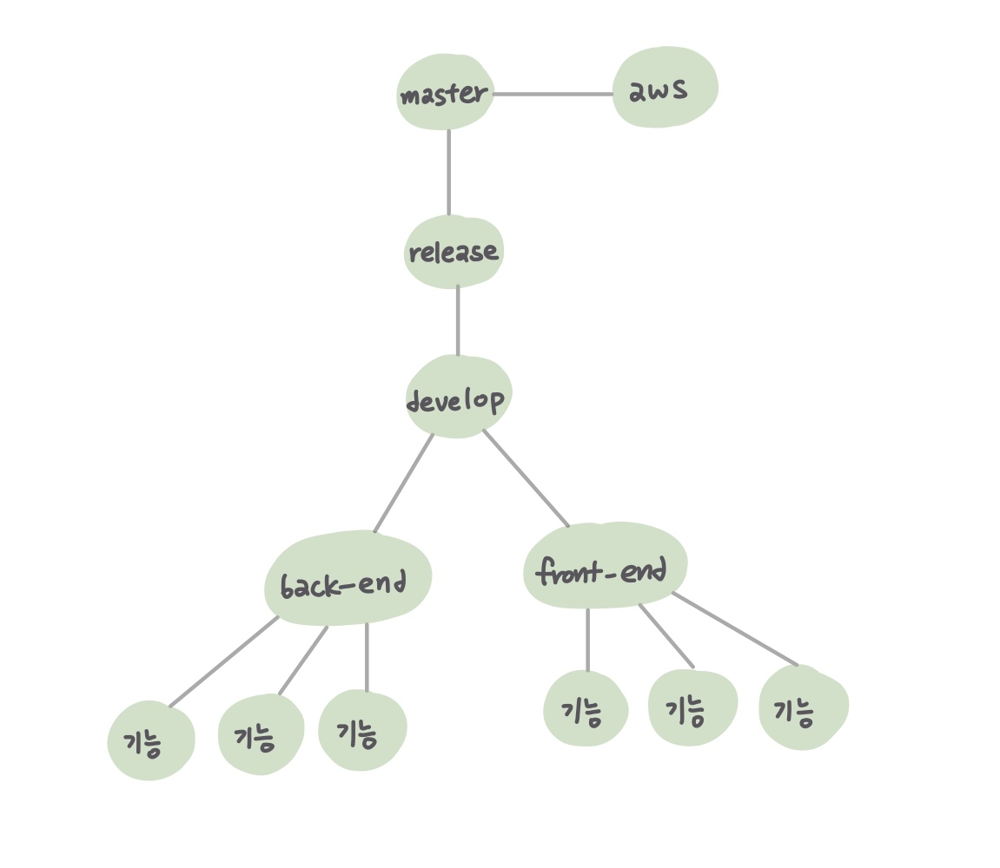

22.01.13

## Gitlab 실습

---

### 개요

- 실제 프로젝트를 진행하기 전, 더미 데이터를 활용한 git 환경에서의 협업을 실습함

### Gitlab 협업 실습

>  

- 지난 시간에 작성한 바와 같이 브랜치를 생성한 뒤, 협업 프로세스에 대해 논의하며 실습을 진행함

  - 자신이 한 기능을 담당하게 되면 해당 파트(back-end, front-end)의 브랜치의 하위 브랜치를 생성

  - 해당 브랜치를 체크아웃한 상태에서 어떤 로컬 작업을 해도 다른 팀원들에게 영향을 끼치지 않음

  - 기능을 완성한 뒤 상위 브랜치에 병합할 때 **문제 발생**

    

### Merge Conflict

- 해당 파트의 다른 팀원이 이미 수정한 파일을 병합하려 할 때 *merge conflict* 발생
- gitlab은 프로젝트 형상관리의 편의성을 제공하지만, 이러한 문제점은 직접 보고 판단해야만 함
- 프로세스(Source Tree 기준)
  1. 개인 브랜치에서 작업을 완료한 후 원격 저장소에 push
  2. 상위 브랜치로 체크아웃
  3. 병합하고자 하는 커밋 내역을 선택하여 병합 수행
  4. *merge conflict* 발생 시 외부 툴(vscode 등)을 통해 수정
  5. 충돌 해결 표시 후 이에 대한 변경 사항 커밋
  6. 최종 push

