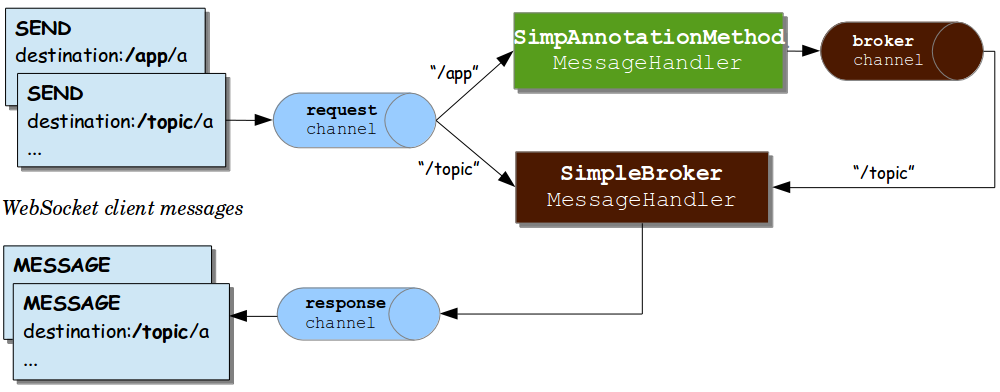

22.02.03

## Stomp 예제 실습

---

### 개요

- Stomp 예제 실습을 통해 채팅 API 구현의 기반을 마련
- 참조 [링크](https://dev-gorany.tistory.com/235)

### STOMP 

- STOMP는 WebSocket 위에서 동작하며 클라이언트와 서버가 전송할 메세지의 유형, 형식, 내용 등을 정의하는 프로토콜
- TCP 또는 WebSocket과 같은 양방향 네트워크 프로토콜 기반으로 동작
- 기본적으로 pub / sub 구조로 되어있음

### 예제 실습

- 의존성 주입

  > **// https://mvnrepository.com/artifact/org.webjars/stomp-websocket
  > implementation group: 'org.webjars', name: 'stomp-websocket', version: '2.3.3-1'**

- StompWebSocketConfig 설정파일 구현
  - **@EnableWebSocketMessageBroker** : Stomp를 사용하기위해 선언하는 어노테이션
  - **setApplicationDestinationPrefixes** : Client에서 SEND 요청을 처리
  - **enableSimpleBroker** : 해당 경로로 SimpleBroker를 등록. SimpleBroker는 해당하는 경로를 SUBSCRIBE하는 Client에게 메세지를 전달하는 간단한 작업을 수행
- ChatMessageDTO
  - roomId, writer, message의 getter, setter 구현
- ChatRoomDTO
  - create 메서드 : name을 받아 랜덤 UUID 코드를 통한 새 ChatRoomDTO 인스턴스 반환
  - roomId, name, sessions의 getter, setter 구현
- ChatRoomRepository
  - findAllRooms : 모든 채팅방을 List로 반환
  - findRoomById : id로 채팅방을 반환
  - createChatRoomDTO : 새 ChatRoomDTO 인스턴스를 반환
- StompChatController
  - 클라이언트가 "/pub/chat/enter" 요청을 하면 처리하여 "/sub/chat/room/[roomId]"로 메세지 발송
  - 이때 클라이언트는 해당 주소를 subscribe하고 있다가 메세지를 받아 화면에 출력
- RoomController
  - 채팅화면을 보여주기 위한 Controller
