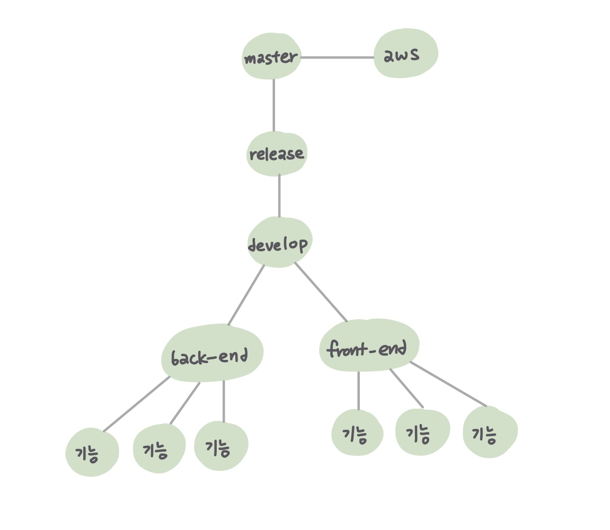

# 2022-01-13 ✨

## 오늘 한 일 💡

1. 어제 협의한 git branch 생성해보기
2. 소스트리 설치 및 실습
   - Test레포지토리 생성
   - 머지충돌 실험
   - 충돌해결방법 토론
3. JIRA 스크럼보드, 스프린트 개념 이해
4. 화면명세 회의
   - SUB1 명세서 분석
   - SUB1 프로젝트 분석
5. WebRTC 개념정리

#### Git Branch 구성 🌿



#### WebRTC

```
WebRTC(Web Real-Time Communication)은 웹 애플리케이션과 사이트가 중간자 없이 브라우저 간에 오디오나 영상 미디어를 포착하고 마음대로 스트리밍 할 뿐 아니라,
임의의 데이터도 교환할 수 있도록 하는 기술입니다.
```

#### STUN

```
UDP 프로토콜 기반으로 동작하며, 클라이언트의 Public IP를 확인하고 시그널링을 수행할 수 있도록 한다. Signaling Server 는 Kurento 미디어 서버가 될 것 입니다.
```

#### TURN

```
클라이언트들이 서로 통신할 때 Public 망에 존재하는 TURN서버를 경유하도록하여 미디어 스트리밍을 P2P방식으로 통신할 수 있도록 해줍니다. TURN은 STUN의 확장개념이다.
```

## 느낀 점 🙄

```
    어제 협의한 git branch들을 직접 스켈레톤 프로젝트에 적용시켜보았다. master, release, develop, back-end, front-end 등으로 나눠 생성했다.
    브랜치를 관리하는게 굉장히 유용하면서도 신경써야할 부분이 많았고 손에 익숙치않아 어렵게 다가왔지만 팀원들과 같이 문제를 의논하고 해결해 나갔다.
    수용님의 주도하에 소스트리를 함께 설치해보고 실습해보았다.
    실습을 위해 깃랩에 스켈레톤프로젝트와 동일한 환경의 Test레포지토리를 생성하고 각자의 브랜치에 맞춰 커밋/푸쉬/머지를 실행하였다.
    머지 충돌시에는 어떤 부분이 문제였는지 상의하며 해결방법을 찾아나갔다.

>> 오늘의 진짜 결론 : 우리 팀 너무 좋다. 다들 착하고 재밌고 친절하다. 공통플젝 만만세다.
```

## 막나가는 장사꾼 🕹

```
속고 속이는 장사꾼들의 치열한 한 판 승부!
이젠 아무도 믿을 수 없다!! 자자 선수입장!
우당탕탕 좌충우돌 장사꾼들의 머리싸움!
과연 거상이 될 자 누구인가!
```
