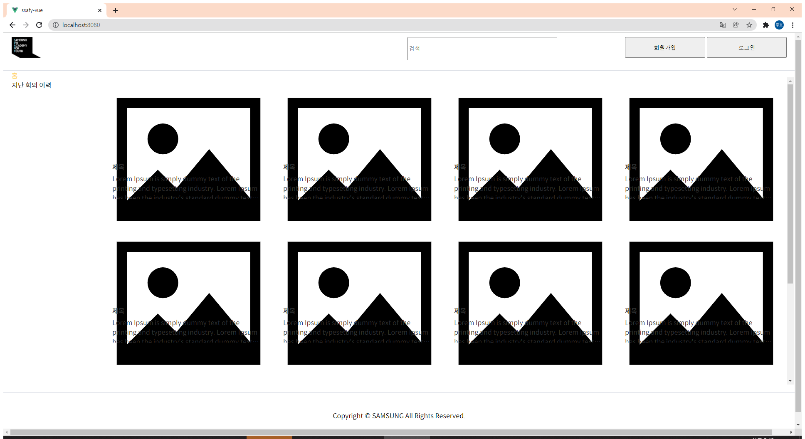
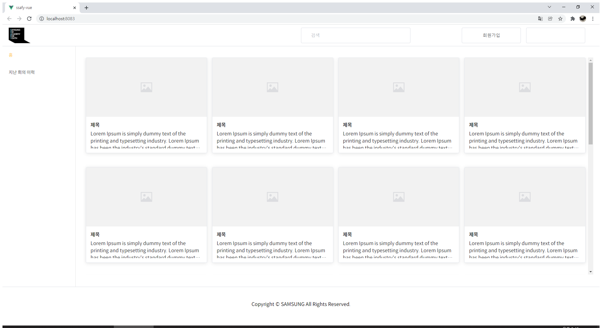

# 22.01.11

- 백 api를 타 팀원이 테스트해보려면 어떻게 하여야 하는가?
  - 소켓 뚫어서 httpwebrequest 방법으로
- index 못찾는 에러
  - vue.config.js에 outputDir 경로 수정(소라님 감사합니다!)
- Vue PostCSS received undefined instead of CSS string 에러
  - npm install node-sass 후 런
  - 그래도 안되면 npm rebuild node-sass 후 런

- 이미지 깨져서 나오는 문제
  - src/view/main/main.vue 22번째 줄
  - @import "https://unpkg.com/element-plus/lib/theme-chalk/index.css";
  - @import "https://unpkg.com/element-plus/theme-chalk/index.css"; 로 변경

