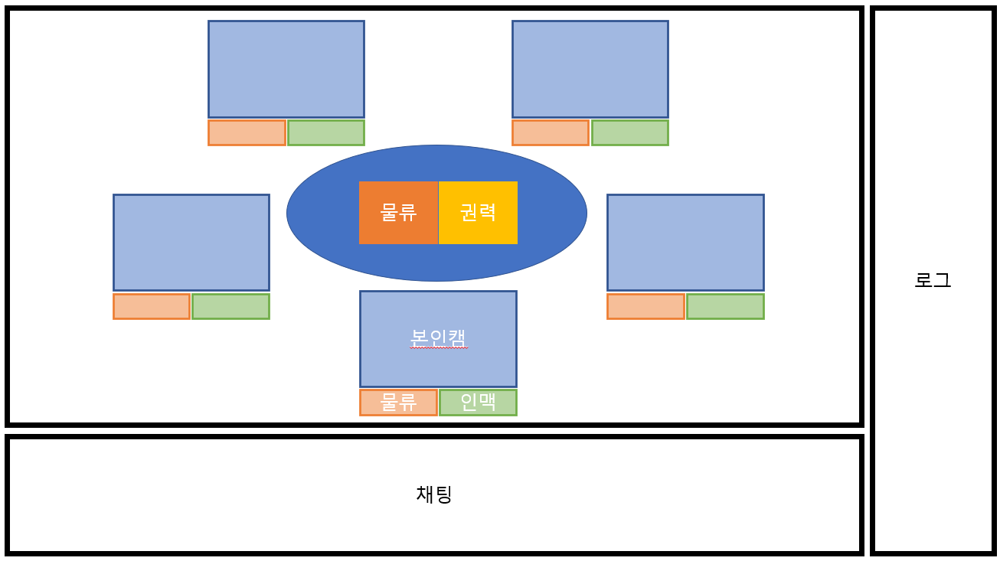

# 22.01.12

## 화면 구성을 한다면 어떻게 할 것인가?

이렇게 만들고 있었는데 소영님이 겁나 이쁘게 그려놨다.. 하.. 인생..

## Why - 왜 Jira인가?

> 4가지 키워드로 나눠 알아보자, 모두 Jira를 이용하면 좋은 것들이다. 지원해주거나, 자연스럽게 따라오는 이점들이다.

### Issue Tracking(Project Management)

#### Issue Tracking

- 우리 팀이 할 일을 정리
- 개발에 한정된 일만은 아님, 우리 팀이 해야 할 모든 것 정리
- 담당자를 정해야 함
- 이슈가 현재 어느 상태인지를 관리, 추적하기 위해

#### Project Management

- analysis
- planning
- 한 눈에 확인할 수 있도록 지원해 줌

### Agile

- 방법론?
- 개발 철학, 개발 문화!
- 문서보다 작동
- 계획보다 변화
- 일단 작동하도록 만들고, 피드백에 따라 계속해서 변화!

#### SCRUM

- sprint 생성(2주정도)
- 백로그에 스크럼 팀이 할일을 담아두고, sprint가 생성이 되면 백로그 이슈 중 할 일을 넣음
- 한 sprint가 끝나면 다시 반복하며 백로그에 있는 이슈들을 해결
- 정기적으로 현 상태에 대해 회의

#### KANBAN

- sprint가 없음
- 담당자별로 상태관리
  - todo
  - in progress
  - done
- 개인에게 할당된 일들에 치중

### DevOps

- 개발, 운영의 악순환을 없애고 간격을 줄여보자
- Jira에서 지원해주는 것들
  - 반복적인 작업들을 Tool로 자동화
  - 팀원 모두가 알고 있는 하나의 공유된 지표가 필요
  - 장애나 이슈가 있을 때 혼자만 알지 말고 팀원들과 공유 필요
  - 그 외 더 다양하고 편리한 것들

### SRE(Site Reliability Engineering)

- 사이트 신뢰성 공학
  - 장애 중점으로, 사이트 장애가 발생해도 얼마 이내에 정상화 될 것인지
- 장애가 발생하지 않도록 어떤 식으로 운영하면 좋을까

## How - Jira & SQL 활용 예시

### Create Issue

- Issue Type
  - Story
    - 사용자가 로그인을 한다
    - 사용자가 글을 작성한다
  - Task
    - 할 일을 등록한다
  - Bug
  - Epic
    - 사용자 관리
    - 서버 관리
    - 큰 틀이라 생각하면 된다

- Summary
  - 이슈 제목
- Reporter
  - 이슈 생성자 혹은 보고자
- Components
  - 하나의 또 다른 항목, 기능적인 관점에서
- Descriptions
  - 설명
- Fix version/s
  - 배포 버전
- Priority
  - 중요도, 이 이슈가 얼마나 중대한가
- Labels
  - 태그
  - 형식에 제한은 없음
- Linked Issues
  - 기존 이슈들과의 연결점
- Assignee
  - 담당자
- Epic Link
  - 해당 이슈가 어느 에픽에 해당하는지
- Sprint
  - 이 이슈가 어느 스프린트에 속하는지
  - 이슈 생성 시 선택할 수도 있고, 에자일 보드의 스프린트에서 세팅도 가능

### JQL

- Jira Query Language
- Jira Issue를 구조적으로 검색하기 위해 제공하는 언어
- SQL과 비슷한 문법
- Jira의 각 필드들에 맞는 특수한 예약어들을 제공
- 쌓인 Issue들을 재가공해 유의미한 데이터를 도출해 내는데 활용(Gadget, Agile Board 등)
- 시간적으로도 탐색이 가능하다
- 필터를 저장하고 공유할 수도 있다

#### Basic Query

> 항목 선택해서 간단하게 검색

#### Advanced Query

> JQL 문법으로 검색

### 현업에서의 Jira 활용

- 이슈 관리에서만큼은 Jira가 사용된다
- Jira와 Github을 연동한다면, 간단한 명령어로 merge와 Issue를 같이 처리할 수도 있다

### 다양한 플러그인

https://www.atlassian.com/ko

