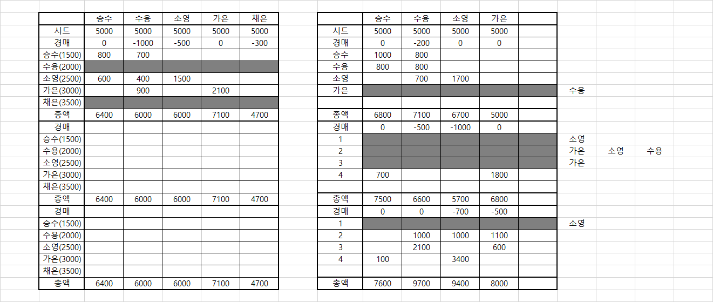

# 22.01.14

## 실제 게임 플레이

> 게임의 기본은 뭐다? '재미'다!

실제 우리가 만든 규칙대로 룰을 정한 후, 게임을 플레이해 보았다.

웹엑스에서 진행했으며, 내가 사회자를 맡았다.

컨셉을 더욱 확고히 하기 위해, 진행 도중 룰을 임의변경하거나 라운드 종료 후 회의를 거쳤다.

처음에는 일반적인 보드게임처럼 말로만 이런저런 진행을 하다가, 아무래도 기록 및 자동화할 필요가 생겨 엑셀과 파이썬의 도움을 받았다.

```python
"""
현재 능력 기본 2개, 추가는 옵션으로 넣어놓음
플레이어에 따라 수를 바꿀건지? 아니면 이대로 갈건지?
능력 풀과 옵션 풀을 완전히 따로 나눠 운용할건지?
일단 기본적인 게임을 위한 코드인만큼 수정 필수
진행 해보고 추후 고칠 것
BE에서 구현할 때에 참고할 것
"""

import random as r

abilities = ["창고", "인맥", "언변", "정보", "로비", "선박"]
options = ["", "인원제한: 브로커 제외 2명 이상", "색 추가", "모든 플레이어", "인원제한: 브로커 제외 3명 이상", "XorY"]
weights = [10, 20, 20, 10, 20, 20]


def turn(min_val, max_val):
    price = r.randint(min_val, max_val) * 100
    option = "".join(r.choices(options, weights))

    if option == "색 추가":
        ability = r.sample(abilities, 3)
        option = ""

    elif option == "XorY":
        ability = r.sample(abilities, 4)
        option = "{}or{}".format(ability[2], ability[3])
        ability = ability[:2]
        ability.append(option)
        option = ""

    else:
        ability = r.sample(abilities, 2)

    print(price, "만원 /", " + ".join(ability),  "/ " + option if option else "")

#items = ["능력 바꾸기", "특정 장사꾼 능력 무효", "깽판치기", "조건 다시 뽑기", "음소거"]

# player = 4
# rounds = 3

# for round in range(rounds):
turn(10, 20)
```

> 코드는 물론 미완성
>
> 오늘 게임 중 어느 정도 굴러가게만 작성해놓은 것을 약간 더 깔끔하게 수정
>
> 마지막에 추가한 규칙 적용
>
> 브로커 능력을 컨셉에 맞게끔 일부 수정



> 게임 진행 로그
>
> 코드 output을 장사꾼들에게 알리고 나는 3분 타이머 및 아이템 사용과 체결, 미체결을 공표
>
> 검은색 라인이 미체결, 옆은 거래 파토낸 사람들


## 추가 고려해볼 것들

- 요구능력들은 장사꾼들이 현재 지닌 능력중에서만? 색 변경권을 매 라운드 주기로 했으니 일단 킵
- 턴 가격 범위 내에서 랜덤(인플레이션이 너무 쎘다)
- 아이템: 새 판 짜기
- 귓속말 우선순위 뒤로 미루기 --> 가면 갈수록 귓속말 시스템 호평, 미루지 않는걸로(굉장히 재미있었음)
- 아이템은 휘발 및 비휘발로 나눔
- 파토났을 때의 유동적 돈의 흐름
- 아이템 경매 2~5번으로(한번은 너무 작다), 상점? 상점 있으면 아이템전될까봐 고민(아이템 소지 수 제한 등으로 범위를 좁히자)
- 암거래상 시스템? 브로커가 가져온 정보에 참여할 수 없는 사람에게 아이템을 비싸게 파는 등?
- 텍스트 표현 잘 하기, 사용자가 한방에 이해할 수 있도록
- 마지막에 게임 로그 전체 보여주기(오버워치 마지막처럼 보여주는 시스템 + 업적도 있으면 좋을듯? `프로깽판러` 같은 느낌으로)


## 느낀 점

확실히 시스템이 사회자 역할을 해 준다면 매끄럽게 잘 굴러갈 것 같았다.

음소거 아이템이 실제 마이크 음소거 + 채팅 금지를 시키니, 오직 캠만으로 협상을 위한 몸부림을 볼 수 있었다. 게임 컨셉을 살리면서도 자연스레 영상을 이용하는 좋은 방법이 되는 것 같았다.

마지막까지 엎치락뒷치락 하는 재미가 매우 쏠쏠했다. 진심으로 재밌을 지도..?

빠른 시일내에 완성해서 편하게 플레이를 즐기고 싶다는 생각이 들었다.

