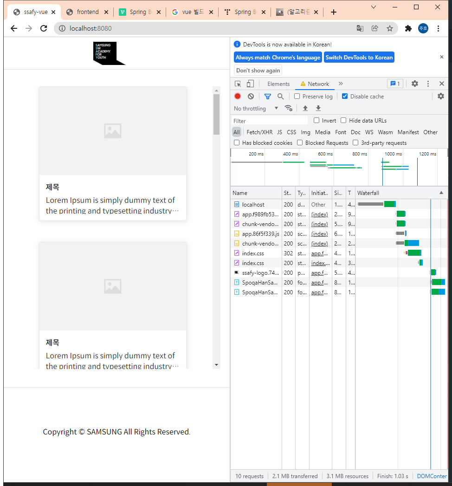
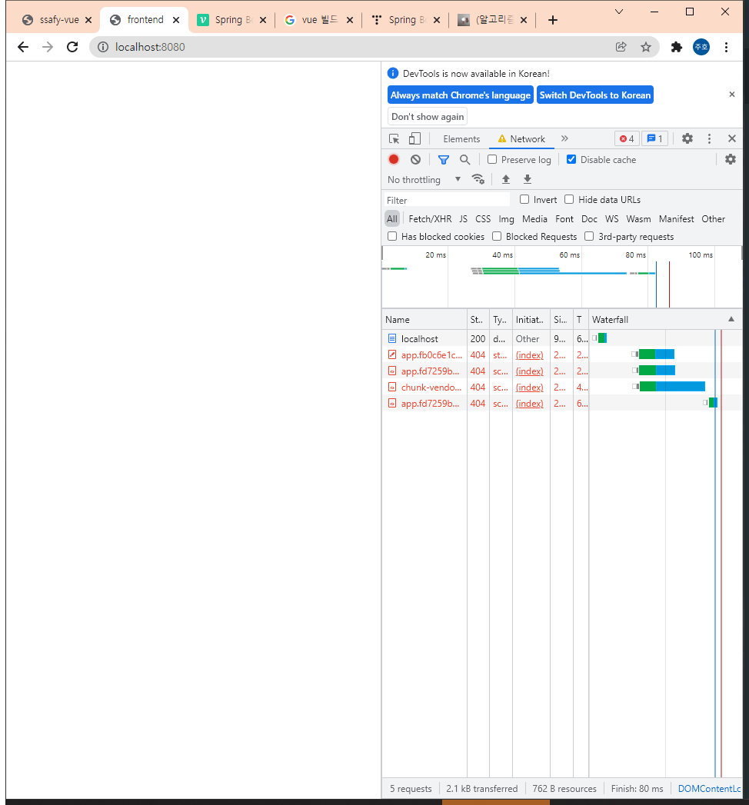
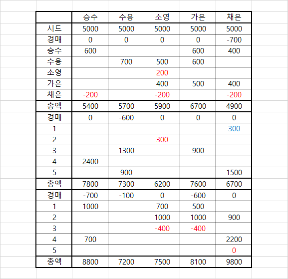
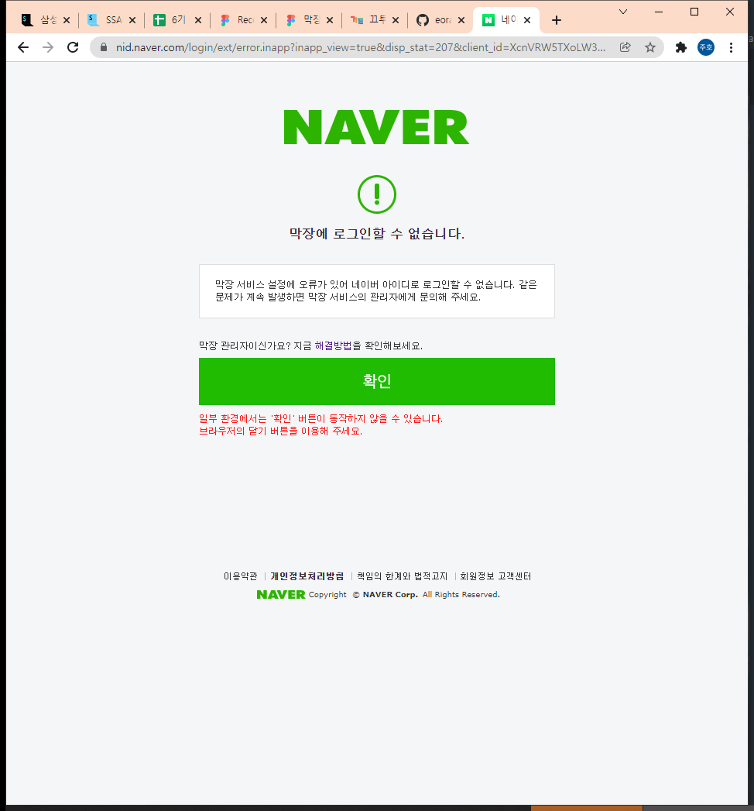
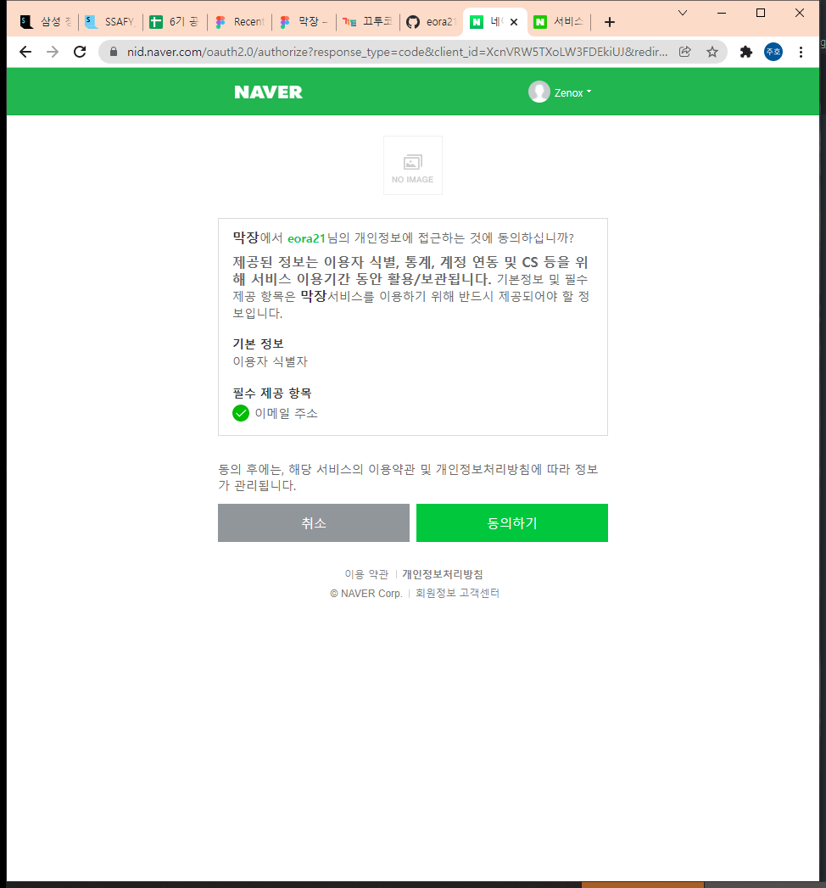
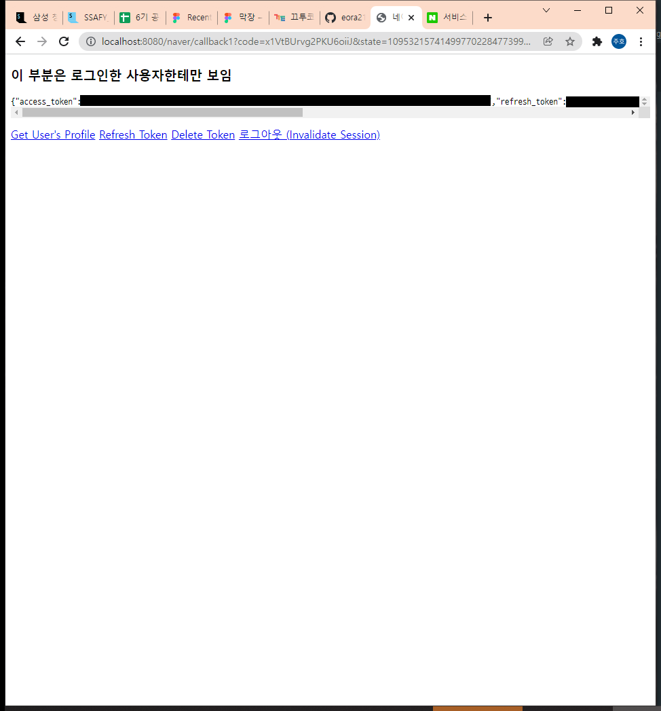

# 22.01.17

## 스켈레톤 해부

> 어떤 구조로 되어있길래 백을 구동하면 프론트가 빌드되는가?
>
> 처음부터 백을 구성하며 확인하자. 새 스프링부트와 기존 스켈레톤 비교하며 내가 이해하는 데까지 해보자!

### 프로젝트 생성 및 세팅

> https://start.spring.io/

- Project
  - Gradle Project
- Language
  - Java
- Spring Boot
  - 2.6.2
- Project Metadata
  - Group
    - magjang
  - Artifact
    - backend
  - Java
    - 8
- 추가 라이브러리
  - Spring Web
  - Thymeleaf


### 생성 후

- controller, domain, repository, service 패키지 생성

- controller 패키지에 IndexController 클래스 생성

- ```java
  package magjang.backend.controller;
  
  import org.springframework.stereotype.Controller;
  import org.springframework.web.bind.annotation.GetMapping;
  
  @Controller
  public class IndexController {
  
      @GetMapping("/")
      public String index(){
          return "index";
      }
  }
  ```

- 테스트를 위해 resources/templates/index.html 생성

- ```html
  <!DOCTYPE html>
  <html lang="en">
  <head>
      <meta charset="UTF-8">
      <title>Title</title>
  </head>
  <body>
  TEST
  </body>
  </html>
  ```

- 작동 확인 완료

- `build.gradle`

  - plgins에 `id "com.github.node-gradle.node" version "3.1.0"` 추가

  - ```
    node {
    	download = true
    	version = '14.17.0'
    	// Set the work directory where node_modules should be located
    	nodeModulesDir = file("${project.projectDir}/../frontend")
    }
    configurations {
    	providedRuntime
    }
    
    task webpack(type: NpmTask, dependsOn: 'npmInstall') {
    	args = ['run','build']
    }
    
    // processResources is a Java task. Run the webpack bundling before this task using the 'build' task in the package.json
    processResources.dependsOn 'webpack'
    ```

    위 내용 plugin 밑에 붙여넣기, 런 할 때마다 front 내용을 빌드

- index.html에 접근이 되지만, 경로 이슈로 화면 구성이 이뤄지지 않음

  - 기존 싸피 스켈레톤에서는 addResourceHandlers가 해당 이슈를 처리해주는 것 같은데 이 녀석의 구조 자체도 잘 모르기 때문에 함부로 쓸 수 없음..






### 실패했으나 알아낸 것

- back이 run할 때마다 front가 빌드된다는 것
- addResourceHandlers가 절대적 경로 접근을 상대적으로 해주는 것 같음. static에 빌드 파일을 넣으면 되려나..?


## 게임 플레이

> 밸런스 조절: 거래 조건 다양화 및 가중치 입력, 아이템 경매 결과 완전 비공개, 거래 배신 한명만일 시 소액 획득, 여러명일 때 배신자 금액 차감 등



> 붉은 색은 배신, 푸른 색은 아이템 사용으로 인한 거래 파토 및 소액 획득

- 모든 플레이어가 강제로 참여하는 조건은 다시 한 번 생각해볼 것, 체결될 확률이 극히 적으면서 브로커가 제 값을 가져가지 못 하는 경우가 많음
- 밸런스는 이 상태에서 살짝씩만 바꾸면 될 것 같음


## Back에서 네이버 로그인 테스트

[해당 블로그](http://yoonbumtae.com/?p=1818)를 참조하여 테스트




콜백 주소 문제, 수정 후 재시도





