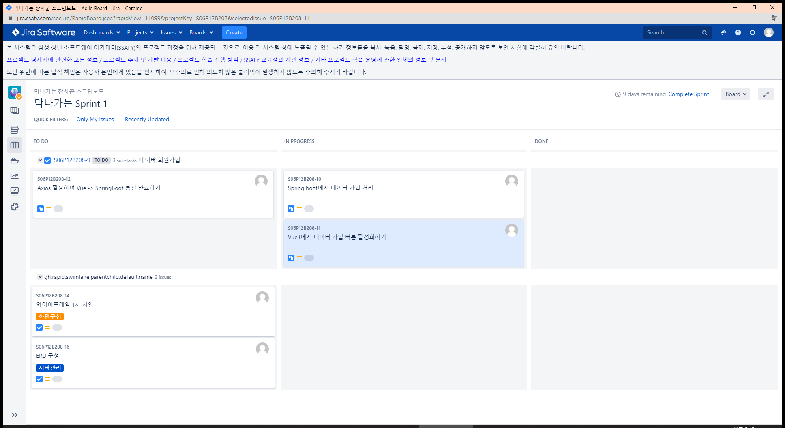

# 22.01.18

## Jira 스프린트 재생성

> Jira 강의대로 이슈, 스토리, 태스크, 멀티태스크 구조 나눈 후 만들기
>
> 이슈와 스토리밖에 없었으나 프로님께서 나머지 추가해주셨다. 감사합니다!

## Vue 네이버 버튼 활성화

> 스켈레톤을 가지고 수정하기엔 내부 구조를 완벽히 이해하지 못 했으니 비틀거리더라도 스스로 만들어보는 것을 계획으로 세움

- `vue create frontend` 후 frontend 폴더에서 vscode 다시 엶
- `vue add vuex`
- `npm run serve`로 구동 테스트
- `npm install bootstrap`
- `import "bootstrap/dist/css/bootstrap.min.css";`
- 네이버 버튼 컴포넌트 생성 후 추가

내일 axios 이용하여 Back과 통신해보기.. 오늘 vue3 부트스트랩 글을 잘못 확인해서 하루를 온통 날려버렸다.. 그냥 내 뇌피셜대로 할 걸..

컴포넌트도 폴더 이용해서 잘 나눠 사용하기..!