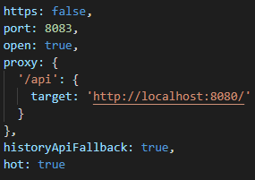

# 22.01.19

## Jira 기준 잡기

### 에픽

- 가장 큰 틀, 최소화할 것
- 회원관리, 화면 구성, 서버 관리, 컴포넌트 규칙 등으로만

### 스토리

- 유저의 행위를 정리
- 태스크와 분리해서 생각해야 한다!
  - 유저의 행동과 관련된 건 스토리 -> 하위태스크, 그 외적인 건 태스크 -> 하위태스크
- 스토리는 해당하는 태스크가 왜 필요한지 설명, 설득을 위해 작성할 것

### 태스크

- 작업해야 할 일
- 어떠한 작업이 필요하다 싶은 게 있다면 태스크로

### 서브태스크

- 일을 쪼개는 것
- 일을 하나만 잡아도 그 안에 여러가지를 동시에 구현해야 할 수 있으므로 필요

## proxy 테스트

스켈레톤에서 준 것처럼 proxy 테스트, 프론트 url 링크 뒤쪽 /api로 접근 시 백 접근 확인

세팅은 기존 싸피 스켈레톤 구조 사용

## assets 경로 간편화

상대경로 일일히 지정하기 귀찮아서 구글링해온 후 적용

