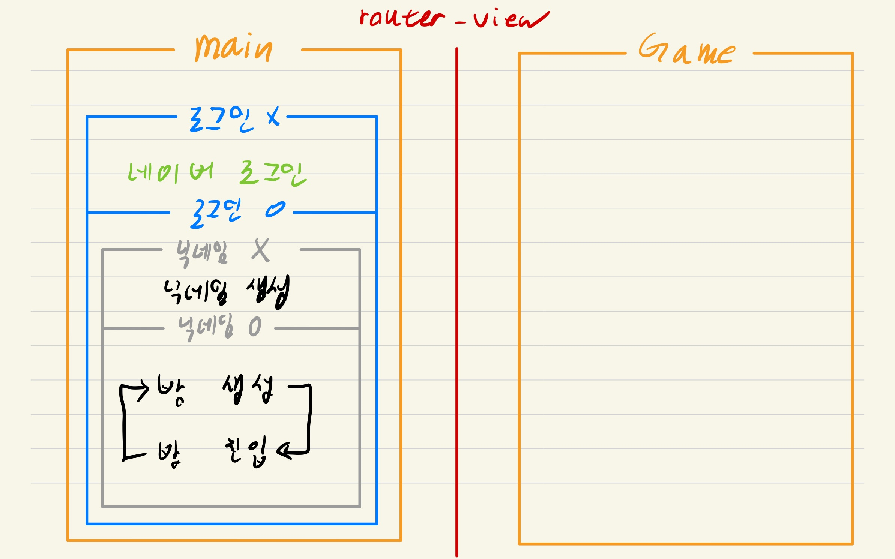
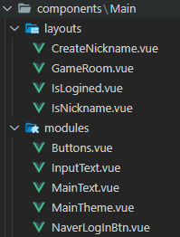
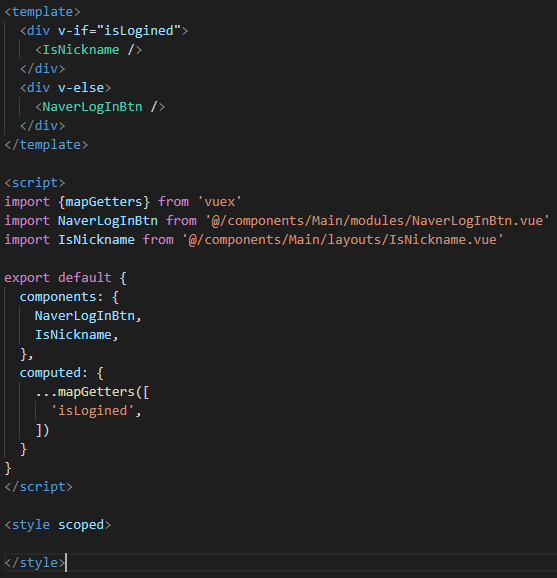

# 22.01.21

## Vue 구조 정리

 Game 부분은 아직 완전 미정

## 컴포넌트 구조로 구현

- layouts: 화면을 구성하는 하나의 틀, 그리드
- modules: 버튼, 입력창 등 layouts를 구성하는 각각의 도구들

### 레이아웃

> 가독성이 좋게 구성

모듈은 수정 필요.. props로만 데이터를 지정해줄 수 있나?
