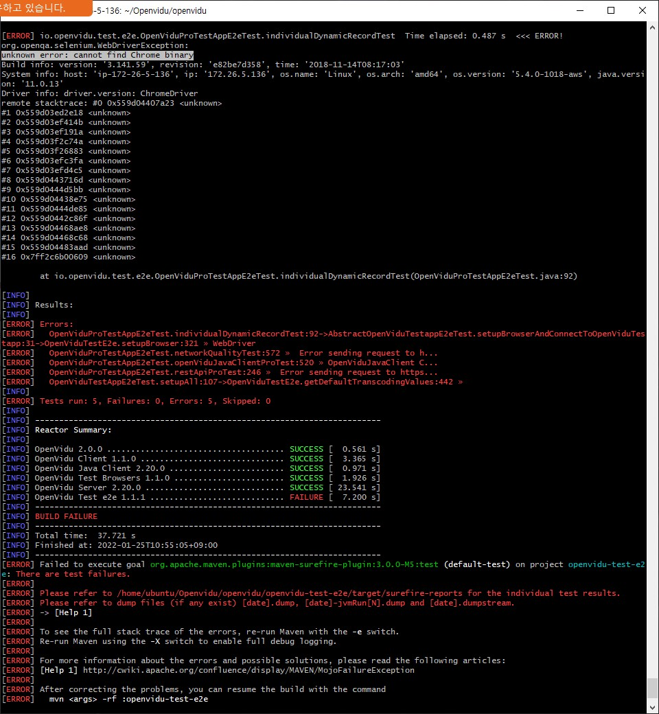
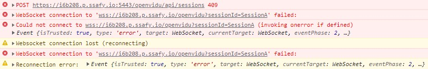
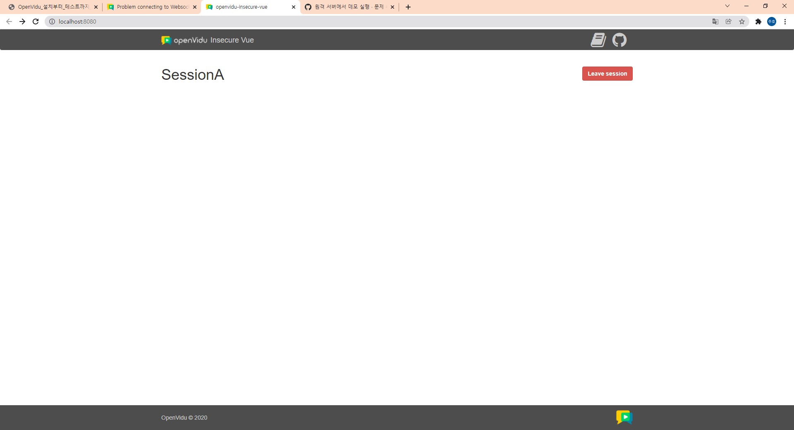
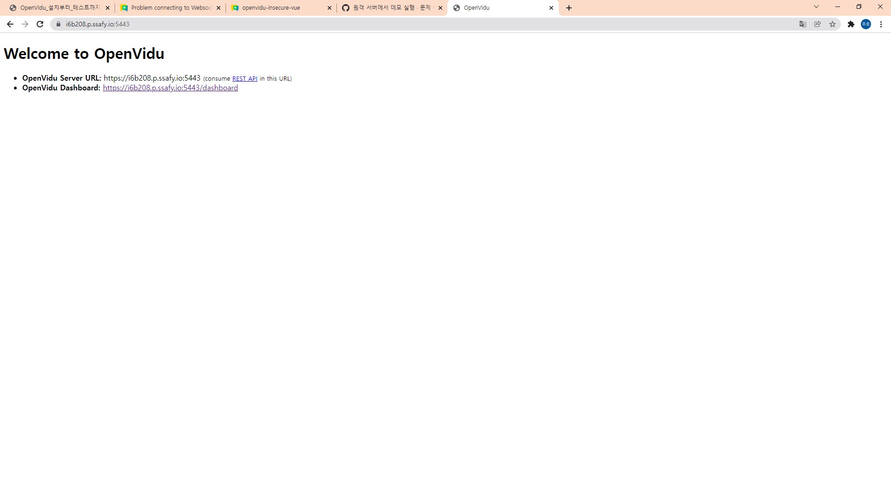

# 22.01.25

## OpenVidu 설치 및 테스트 완료

삭제 후 다시 실행, 에러코드 변경됨

크롬 바이너리가 없다? 우분투에는 크롬이 깔려있지 않다!

직접 크롬켜서 테스트했을 때는 문제가 없었으므로 건너뜀

## SSL 인증서

`sudo certbot certonly --standalone -d 도메인주소`를 사용하여 받은 후 진행

## Vue test

마지막에 에러가 몰아침.. 왜지?

환경 세팅 중 443으로 잡힌 항목을 5443으로 바꾸니 성공. 승수님의 매서운 시선..!

오예
