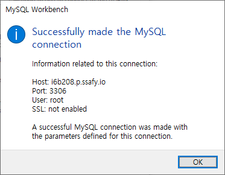
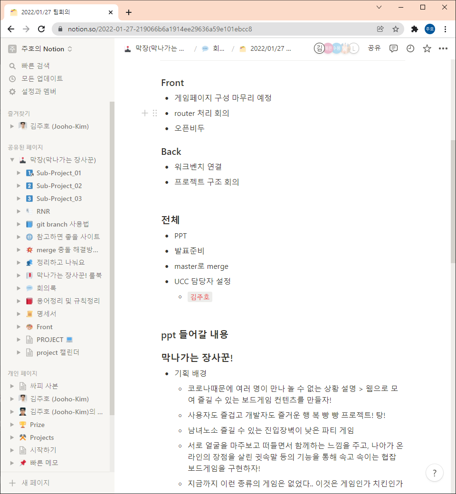

# 22.01.27

## MariaDB 이슈

도커에서 이미지를 받아와 띄운 MariaDB에서 한글 입력이 깨지는 문제 발생. 설정을 바꾸고 도커를 다시 실행시키려 했으나 도커를 한번 거쳐야 하고.. 명령어들이 제대로 먹히지 않음. 다시 켰더니 무한 로딩이 걸림.. 

우분투에 바로 깔고 외부접속 허용해주는 쪽으로 세팅

환경설정에서 값 바꾸고 root에 ip 모두 허용

접근 확인

## 팀 회의

내일 있을 발표를 위해 모두 노션에서 회의. ppt에 들어갈 내용 이것저것 얘기하며 다들 노션에 옮겨적음