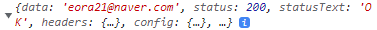

# 22.02.03

## DB 연동

명절 내내 SpringBoot JPA를 만지작거렸는데, 틀을 잡고 난 뒤 빌드 에러가 났었다.

생각해보니 DB 연동을 안한 채 코드만 냅다 작성해서 일어난 문제였다.

오전에 팀원들과 회의 후 DB 연동을 하였다.


`build.gradle`에

```
runtimeOnly 'org.mariadb.jdbc:mariadb-java-client'
```

추가


`application.properties`에

```properties
spring.datasource.driver-class-name=org.mariadb.jdbc.Driver
spring.datasource.url=jdbc:mariadb://i6b208.p.ssafy.io:{포트}/{테이블 네임}
spring.datasource.username={DB 유저네임}
spring.datasource.password={DB 유저 패스워드}
#update the schema with the given values.
spring.jpa.hibernate.ddl-auto=update
#To beautify or pretty print the SQL
spring.jpa.properties.hibernate.format_sql=true
#show sql
spring.jpa.properties.hibernate.show-sql=true
#show parameter binding
logging.level.org.hibernate.type.descriptor.sql=DEBUG

logging.level.org.hibernate.SQL=DEBUG
```

추가

이후 빌드하니 DB에 컬럼들도 알아서 생겼다.. 신기하다

참고로 에러가 이것저것 많이 났는데.. 역시 내 자신과 팀원들을 믿고 진행하는 게 더 나은 것 같다.

블로그 참고했다가 1시간동안 에러만 잡았다 ㅎㅎ..


## API 테스트

네이버 로그인이 뭔가.. 맘에 들지 않는다. 글을 찾아 읽으면 읽을수록 네이버가 손을 놓은 느낌이 든다.

어쩔 수 없이 vue에서는 로그인을 통해 토큰을, springboot에서는 해당 토큰을 건네받아 유저 이메일을 얻은 후 계정 가입에 쓰이게끔 했다.

api 테스트 도중에도 에러가 많이 나왔으나 해결하였다.



JsonParse를 통해 이메일만 건네주는 것 까지 확인. 해당 이메일을 DB에 넘겨 가입시키도록 하였다.