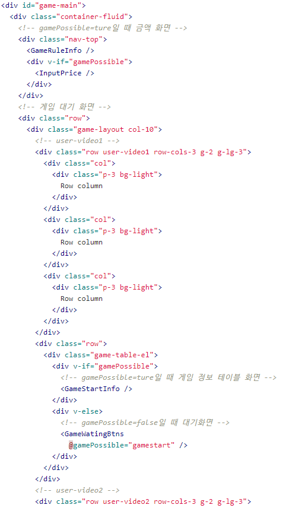

# 22.02.07

## GameMain 컴포넌트 구분

기존에 짜여진 openvidu 튜토리얼 기반의 코드가 너무 번잡해서 컴포넌트를 쪼개기로 하였다.

이대로 써도 상관은 없으나.. 가독성 등의 면에서 너무나 눈에 들어오지 않았다.

구조를 하나하나 쪼개나아가다가..

## Openvidu 비디오 에러

유저가 방을 나갔을 때, 나간 유저 카메라가 계속 사용중이며 방을 나간 지 2~3분이 지나야 세션에서 빠지는 현상과, 세션에서 빠지게 되면 다른 사람들의 배치가 바뀌면서 캠과 음성이 나오지 않는 현상이 있었다.

첫 번째는 세션아웃이 누락되어 일어난 일인 것 같으나.. 두번째는 어떻게 해결해야 할 지 모르겠다.