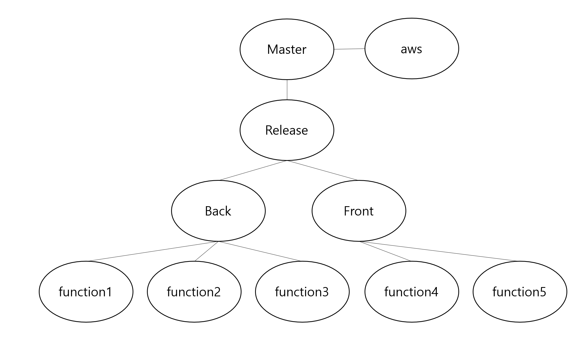

# 220112_Readme

### 📝 To Do List

✅ 화면구성_게임화면&로그인 (초안)
✅ git branch 구성
✅ JIRA 사용 test

---

### 화면구성

 처음에 개발 전 단계 중 어떤것을 해야할까 이야기를 나누며, 화면 구성이 어떤식으로 진행되어야 할 지 생각을 해보면서 백과 프론트에 필요한 정보들을 정리해보기로 하였습니다. 화면 구성을 생각하며, 점점 우리가 구현할 수 있을지에 대한 의문이 생겼지만 1~5기 선배들은 해내셨기때문에 우리도 해결할 수 있지 않을까? 라는 생각을 하게되었습니다.

 여러가지 의견이 나왔고, 어느정도로 계획을 해야하는지 서로 몰라서 어려움이 있었지만, 우선 가장 메인이 될 `게임화면` 과 `첫 페이지` 화면을 구상하였습니다.

---

### git branch 생성

 팀원분들과 git branch를 어떤식으로 구성하면 좋을지 이야기하고 정했습니다.

function에 관해서는 추후 이야기 할 예정입니다.

---

### 컨설턴트님과 팀미팅

 첫 팀미팅을 진행하였습니다. 분위기 좋은 저희 팀이기에 팀미팅때에도 큰 걱정없이 진행할 수 있었습니다. 나중에 컨설턴트님 혹은 실습 코치님께 여쭤 보기에 좋은 출발이였던 것 같습니다.

---

### JIRA 사용 

팀원 분들과 팀미팅 진행 후 JIRA test를 해보기로 했습니다. 이렇게 저렇게 칸반보드도 만들고... Task 와 SubTask를 만들어보았습니다.

---

### TIL

월요일, 화요일에 회의할 당시에는 그림으로 그려서 설명했었는데, JIRA와 GIT 설명을 하면서 어려움이 많았습니다. 하지만 화면공유를 하면서 진행하니 수월하게 진행할 수 있었습니다.

다른 분들의 진행 상황도 알기 어려움이 있지만, 서로 챙겨주면서 진행하는 것이 협업에서 중요하다고 느꼈습니다. 

