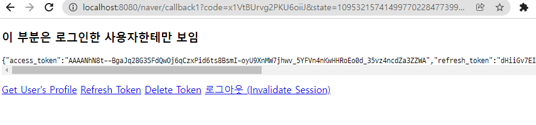

# 220117_Readme

### 📝 To Do List

✅ Git, JIRA 다시 설정하기
✅ 게임 밸런스 조절
✅ 와이어프레임 작성
✅ ERD 구성
✅ 네이버 로그인 구현해보기

---

### Git, JIRA 다시 설정

* 이전에는 프로젝트를 한 번 돌려보는 경험, 이제 정말 이번 프로젝트를 위한 git과 jira를 다시 생성하였습니다. 오류 발생..걱정되지만 현업가서 발생하는 것보다 지금 발생해서 팀원들과 열심히 해보자! 라는 행복회로..

---

### Game Balance

* 게임을 한 번 실행하면서 발생할 이슈들을 정리하였습니다.
  * 능력을 텍스트로 작성하는 것이 가독성이 떨어진다.
  * 모든 player들이 협상에 참여해야하는 경우에는 조건을 없애는 것이 좋을 듯
  * 능력에서 '재력' 관련은 다른 것으로 => 꼴지가 재력이 많다는 것은 별로
  * 게임 협상 파토
    * 1명만 파토내는 경우 => 라운드 별(1R : 200, 2R : 300, 3R : 400 만원) 금액 챙겨줌
    * 2명 이상 파토내는 경우 => 라운드 별 금액 차감

---

### 와이어 프레임 작성

* ERD 작성을 위한 와이어 프레임 작성
* Figma 활용

* 소영님이 만들어주신 배너! 로고!

---

### 네이버 로그인 구현

백에서 잘 작동하는 것 확인하였습니다. 내일(1/18) Vue에서 확인 할 예정입니다.

---

### TIL

2차 팀미팅을 갖게 되었습니다! 박종철 컨설턴트님께 저의 프로젝트에 대하여 설명드렸습니다. 기억남는 조언은 

1. 새로운 게임을 만들기에는 어려움이 많으므로 기존의 게임을 그대로 가져오는 것을 추천
2. 게임을 진행하며 웹 화면이 필요한 이유
   1. 오프라인에서는 **귓속말**이 어렵지만, 온라인에서 귓속말 기능 가능
   2. **음소거** 기능의 아이템 => 모션으로 대화하는 재미 추가
   3. 오프라인 게임 시 한 명이 사회를 봐야하는 상황에서 사회자가 재미가 하락 => **시스템이 사회자**의 역할
3. 네이버로 쇼설 로그인 기능
   1. 배운것을 이용하여 중복 가입을 막고 서비스를 구현할 수 있지만, 사용자의 편의성을 고려하여 소셜 로그인으로 진행
   2. 카카오의 경우 개인정보(이메일)을 지원하지 않으므로, 네이버로 로그인을 사용하여 사용자의 중복 로그인을 지양

차근차근히 개발하면서 프로젝트가 끝이 날 때 쯔음 어떤 게임 화면이 나올지 기대가 되었습니다. 우리 팀원들이 모두들 다양한 아이디어와 의견을 내주시는데 그것을 만들 수 있을 지 의문을 갖고 불안함을 가졌는데, 그렇게 불안해하기보다는 창의적 아이디어를 모두 다 받아드리고 어떤식으로 구현하면 좋을지 아이스 브레이킹을 하는 것이 중요할 것 같다고 생각했습니다.

불안하고 걱정하는 마음보다는 스스로 열심히 공부하고, 팀원 분들께 열심히 물어보면서 앞으로의 프로젝트를 잘 해나가기를 바랍니다 :)

우리 팀원 분들... 정말 한 분 한 분 너무 친절하고 잘 도와주셔서 감사합니다! 이렇게 좋은 팀 분위기와 팀원 분들을 만날 수 있게 됨에 너무 행복합니다ㅎㅎ 이렇게 좋은 팀원분들을 만나게 된만큼, 저도 노력해서 더 좋은 팀원이 될 수 있도록 노력하겠습니다!!