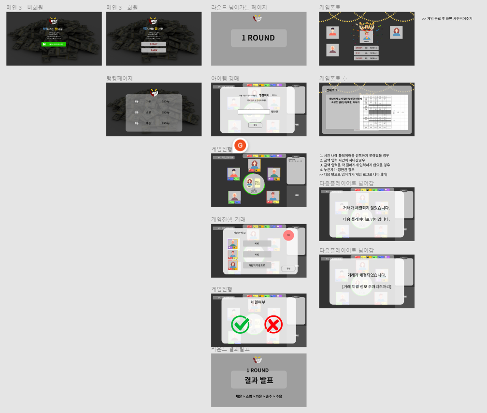
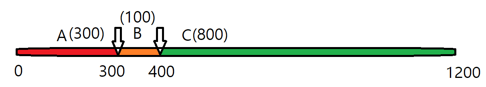

# 220118_Readme

### 📝 To Do List

✅ 와이어 프레임 1차 목업 완료
✅ ERD 작성 완료
✅ Vue 확인

---

### 와이어프레임 1차 목업 완료

[와이어프레임]: https://www.figma.com/file/mzo4Tv7Wr6cBA4NuXsnZlq/%EB%A7%89%EC%9E%A5?node-id=64%3A381

  1차 목업을 완성하였습니다! 목업을 진행하면서 팀원들 간에 프로젝트 구조와 기능과 구현에 대하여 더욱더 구체적으로 이야기를 할 수 있었습니다. 5기 선배들이 작성하신 싸피아를 참고하며, 저희도 실현이 어디까지 가능할 지 이야기를 나누었습니다.

​	거래를 진행할 유저를 선택하고, 금액을 분배하는 시스템 화면을 어떤식으로 구상하면 좋을지에 대하여 2가지 의견이 나왔습니다. 첫 번째 의견은 값을 사용자가 text로 입력하는 것이고, 두 번째 의견 슬라이드 방식으로 사용자가 조절하는 방식으로 구현하는 것입니다. 
​	첫 번째 의견에서 나온 단점으로는 거래 금액을 사용자가 넘치게 작성하거나 계산해야하는 경우가 발생할 수 있으므로 두 번째 의견이 나왔습니다. 두 번째 방식으로 구현하던 중, 슬라이드 바를 구현하면 (1) 300, 100, 800 만원을 사용자에게 지정할 때 어떤 사용자에게 각각의 금액을 지정할 것인가에 대한 이슈 (2) 슬라이드 바 선택이 교차되어 지원되는 경우 (3) 300, 400(100), 1200(800) 이라 한다면, 사용자가 직접 계산을 해야하며 300, 400(100)인 상황에서 300을 주려고 했던 사용자에게 400만원을 주려고 한다면, 뒤에 있는 버튼을 조절해서 진행해야한다는 고려 사항이 생겼습니다.

​	다음과 같은 고려사항으로 인하여 다시 첫 번째 방식으로 구현하기로 정하였습니다. 다양한 의견이 있고 그 의견을 수렴하며 소통이 잘 되고 협조를 잘해주는 저희 팀원들에게 다시금 소중하고 감사하게 느꼈습니다.

---

### ERD

back 담당자 분들께서 ERD를 완료하였습니다 :)

---

### TIL

목업이 프로젝트에 얼마나 중요한 지 깨닫게 되었습니다. 프로젝트를 할 때에 정확한 목업이 있어야 설계가 탄탄하게 작성될 수 있다는 것을 느꼈습니다. 아직 부족함이 많은 목업이라 앞으로 업데이트가 계속 되어야하고 되겠지만 그 과정속에서 많은 것을 배울 수 있기를 기대합니다!