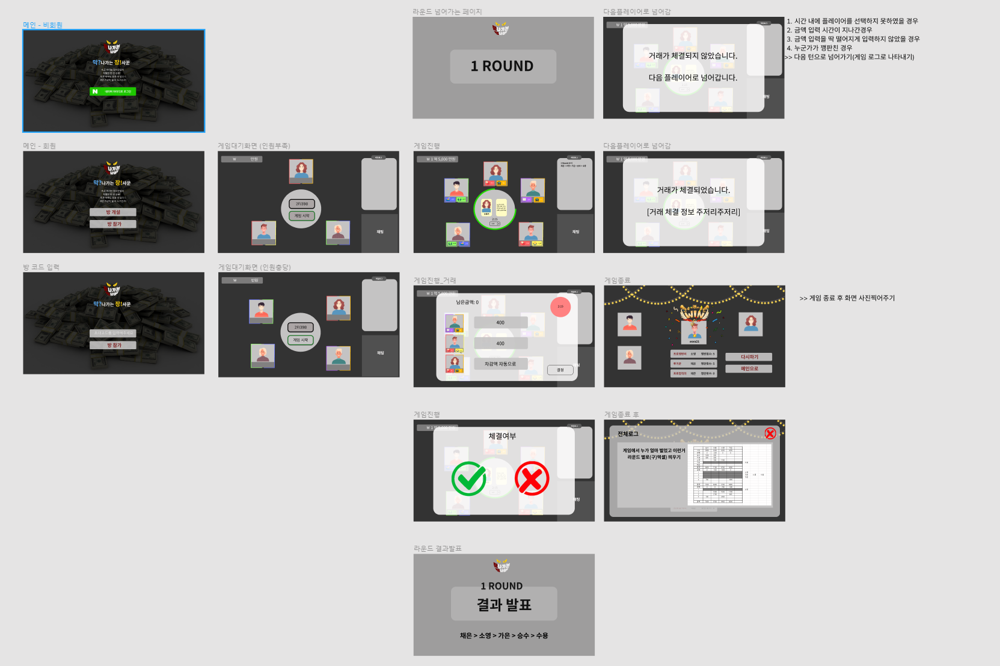

# 220118_Readme

### 📝 To Do List

✅ RNR 정하기
✅ 스토리포인트 작성
✅ 사용자 경험 순서 작성
✅ API 명세 작성

---

### RNR 정하기

- `채은`  : 팀장
- `주호`  : 배포 팀장
- `승수`  : 백엔드 팀장
- `소영`  : 프론트엔드 팀장
- `수용`  : 게임 밸런스 팀장🍣
- `가은`  : 프로젝트 매니저

---

### API 명세서 작성

* 화면 구성에 필요한 API명세를 작성하기로 하였습니다. 백에서는 PostMan으로, 프론트에서는 화면에서 확인하는 식으로 테스트를 해볼 예정입니다.

---

### 스토리포인트 & 사용자 경험 순서 작성

* 처음 계획에는 Item이 있는 상황을 생각하고 프로젝트를 계획하였지만, 우선 게임 진행에 필요한 최소한의 프로젝트를 진행하기로 하였습니다. 그렇게 2차 목업을 진행하고, 스토리 포인트를 작성하였습니다.

  

---

### TIL

전공자 분들과 대화하면서 제가 많이 부족하고 아는 것이 없다는 것을 느꼈습니다. 이해하기가 어려운만큼 스스로 찾아서 공부하는 것이 필요하다고 느꼈습니다. 오늘 명세를 좀 더 살펴보고, 전체적인 흐름을 알 수 있도록 공부를 해야겠다고 느꼈습니다.

또한 프론트 작업을 하면서 Vue3에 대하여 추가 공부가 필요할 것 같습니다. 저번 프로젝트에서는 Django와 VanilaJS로 프로젝트를 진행해서 Vue가 부족함이 많은데, TypeScript와 Vue에 대하여 추가적인 공부가 필요하다고 느꼈습니다.

 