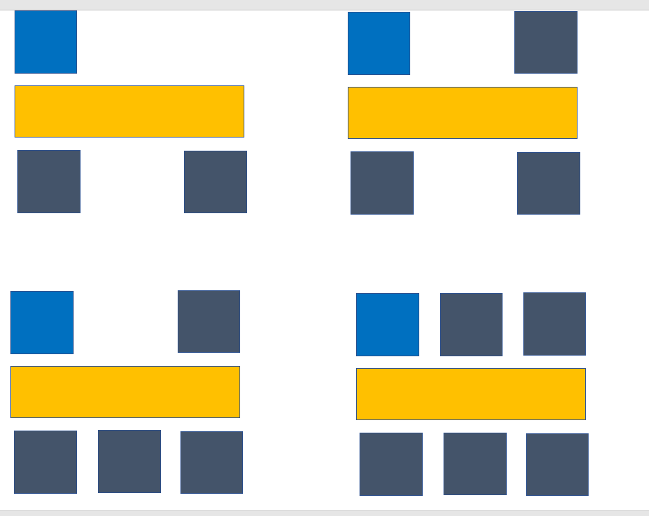

# 220207_Readme

### To Do List

✅ OpenVidu 사용자가 창에서 나갈 때, 남아있는 오류
✅ OpenVidu 화면 배열 깨지는 오류
✅ Main화면 클릭 시 라우터 변경
✅ Component 이름 변경
⬜ 영상 클릭시 금액 입력 창 띄우기

---

### 📝TIL

### OpenVidu 사용자가 창에서 나갈 때, 남아있는 오류

OpenVidu에서 사용자가 나가도 이름과 화면이 남아있는 오류를 발견하게 되었습니다. 이에 따라 코드를 확인한 결과 leaveSession()이 없음을 알게되었습니다.

```javascript
leaveSession () {
      // --- Leave the session by calling 'disconnect' method over the Session object ---
      if (this.session) this.session.disconnect();

      this.session = undefined;
      this.mainStreamManager = undefined;
      this.publisher = undefined;
      this.subscribers = [];
      this.OV = undefined;

      window.removeEventListener('beforeunload', this.leaveSession);
		},
```


### OpenVidu 화면 배열 깨지는 오류

 원래 openVidu에서 사용자 화면을 출력할 때

```html
<user-video
    v-for="sub in subscribers"
    :key="sub.stream.connection.connectionId"
    :stream-manager="sub"
    @click="updateMainVideoStreamManager(sub)" />
```

와 같이 subscribers에서 sub를 for문으로 출력하여 영상을 제공합니다. 하지만, 저희 프로젝트에서는 



와 같이 사용자의 화면을 들어온 순서에 따라 자리를 배치하고 싶어서 배열을 사용하여

```html
<user-video
    :stream-manager="this.subscribers[0]" />
<user-video
    :stream-manager="this.subscribers[1]" />
```

등과 같이 사용하였습니다. 하지만, 이렇게 index로 접근하여 화면 송출을 하다보니 먼저 들어온 user가 leave session을 할 시 뒤에 있던 user들이 앞으로 index가 넘어오면서 화면과 오디오가 따라오지 못하는 경우가 발생하였습니다. 이에 따라 **아직 수정중에 있습니다..ㅠㅠ**


### Main화면 클릭 시 라우터 변경

```vue
<template>
	<button
        type="button"
        class="btn mj-btn"
        @click="[leaveSession(), goBack()]">
        메인화면으로
    </button>
</template>
<script>
    methods: {
        goBack() {
          this.$router.push({ name: 'Game' })
        },
        leaveSession() {
          this.$emit('leave-session')
        }
      }
</script>
```

click event에 2개의 함수 설정

---

### 영상 클릭 시 금액 입력 창 출력

모달로 구현할까 고민했지만, data 통신을 원활하게 하기 위하여 component를 사용하기로 했습니다. 내일 화이팅..!