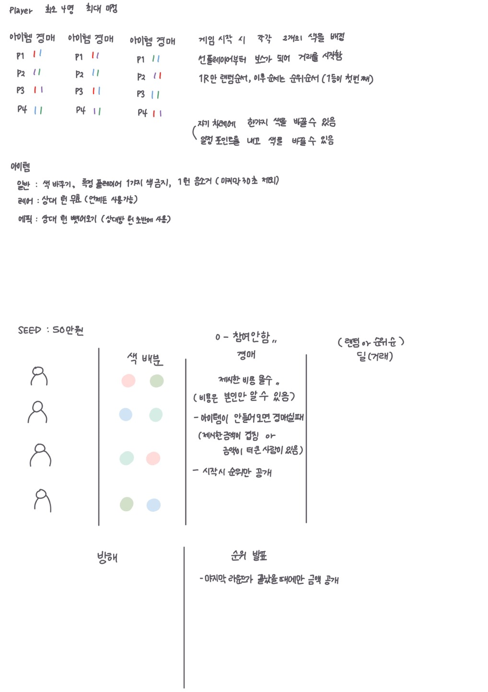

# 20220110 회의

#### 목표

> + 서비스 주제명 정하기
> + 서비스 주제 소개

#### 오늘 수행한 일정

>+ 서비스명 : 막나가는 장사꾼
>+ 서비스 주제 : WebRTC를 이용한 온라인 화상 게임
>+ 서비스 기획 진행

#### 오늘 느낀점

> 낯을 많이 가려서 회의하는 내내 참여를 잘 못했었는데 앞으로 더 참여를 열심히 하고 의견을 잘내야겠다는 생각을 했다. 
>
> 아이디어 회의를 하는 동안 지난번에 정한 모자의 역할에 너무 연연해 하지않고 서로의 의견을 존중하며 좋은 아이디어들은 호응도 하고 아이디어를 실현했을때의 예측가능한 문제점이나 해당 아이디어를 위해 더 구현해야 할 추가기능들을 생각해보는 과정을 통해 관점을 향상시킬 수 있는 좋은 시간들이었다.

