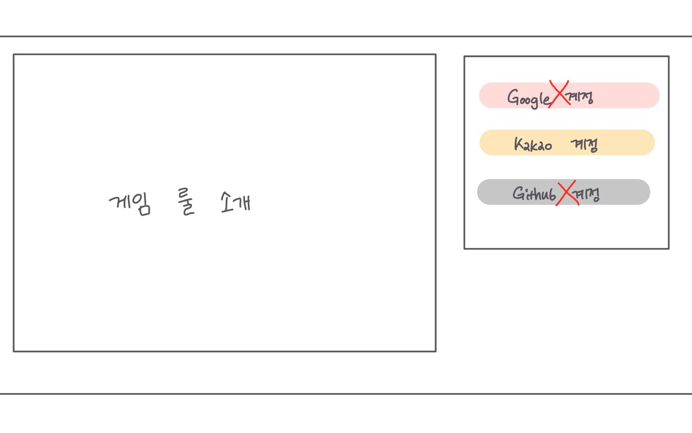

### 20220112

------

##### 오늘 할 일✔

- [x] 팀 미팅
- [x] 화면 구성
- [x] Git Flow 생각해보기
- [x] Jira 실습


##### 팀 미팅 💭

> 컨설턴트님과 실습코치님들과의 간단한 대화 진행


##### 화면 구성✏



> + index페이지
>
> + 좌측에는 게임 룰 설명, 우측에는 로그인 화면 또는 로그인 완료시에는 게임시작 버튼으로 변경됨
>
> + 각 유저의 계정을 본래 Google, Kakao, Github 등의 계정을 이용하여 연동하려 했으나 그럼 신고기능을 통해 유저를 제한하는 사항과 관련하여 다른 계정을 연동하게 되면 의미가 없어질 수 있다는 문제점이 있음 
>
>   👉 카카오 계정은 한 핸드폰 번호 당 하나의 계정만 생성할 수 있기 때문에 유저들이 중복 가입을 하지 않을 수 있고 대부분의 유저가 카카오 계정이 있어 대부분의 사람들이 게임에 참여할 수 있을 것으로 예상, 또한 DB 생성 시 유저의 닉네임을 기본키로 하여 각 유저를 구분지음으로써 신고기능 구현시 활용하면 될 것으로 생각


> + 플레이화면
>   + 각 플레이어의 능력은 아이콘과 각 색상을 달리 하여 구분하기 용이하도록 하기
>   + 해당 턴 플레이어의 색을 달리하여 어떤 플레이어가 플레이 중인지 표시
> + 채팅
>   + 최대 갯수의 채팅이 지워질 경우 앞서 보낸 채팅로그 삭제 ( 자료구조 큐 이용 )

❗ 해당 화면 구성은 아직 확정된 내용들이 아니므로 언제든 수정 및 변경 가능


##### Git Flow 흐름✏


> + 크게 Back과 Front 역할별로 나누기
> + 세부적으로 각 역할의 기능별로 나누기


##### JIRA 실습 💡

> + 칸반 소프트웨어란?
>
>   👉 접착 메모지를 붙여서 "수행", "수행 중", "완료"를 나타내는 보드로, 소프트웨어 개발 팀에서 많이 사용하는 방식이며 팀의 작업 수용량에 따라 수행해야 할 업무를 시각화
>
>   👉 스크럼 또는 애자일 관리와 함께 자주 사용되며, 프로젝트 진행 상태를 시각화, 작업 우선순위 지정, 문제점 식별에 유용한 관리 툴
>
> + JIRA 이슈 유형
>
>   ```markdown
>   👉 Epic : 여러 스프린트에 걸쳐서 끝나지 않고, 여러 스토리들의 집합
>   👉 Story : "{사용자}로써 {무엇}을 하고싶다"에 대한 Actor의 UseCase
>   👉 Chore : 사용자와는 직접적으로 관계되지 않는 개발 (DB 세팅, 분리 등)
>   👉 Task : 구현에는 직접적으로 관련이 없는 업무 (문서작성 등)
>   👉 Issue : 이슈 사항 (서버 다운, 클라우드 계약 등)
>   👉 Bug : 테스트 엔지니어로부터 버그로 리포팅된 타입
>   👉 Sub Task : 스토리 혹은 초어들을 개발하기 위해 진행되는 실제 세부 개발사항들
>   ```


##### 일과 이후 할 일 📁

> + JIRA 강의나 자료 찾아보고 팀원들과 공유하기


##### 오늘 느낀점

>  오늘 화면 구성 회의를 하며 우리가 실제로 개발할 수 있는지를 생각하다보니 다양한 아이디어를 제시하지 못한것 같아서 스스로 아쉬움이 남는 회의였다.
>
>  오후에 진행한 JIRA 실습에서는 JIRA를 직접 해본 사람이 없어 이번 기회에 JIRA를 확실히 익혀야 앞으로 프로젝트를 진행하는데 있어 좀 더 수월할 것이라 생각되었다. 그래서 팀원들과 함께 오늘 일과 이후에는 JIRA 관련 강의나 자료를 찾아보고 유용한 것이 있다면 팀원들과 공유하는 시간을 갖기로 하였다. 오늘 JIRA를 모두 알지는 못하겠지만 이번 공통 프로젝트 내에 JIRA 사용법을 많이 익히도록 노력해야겠다.