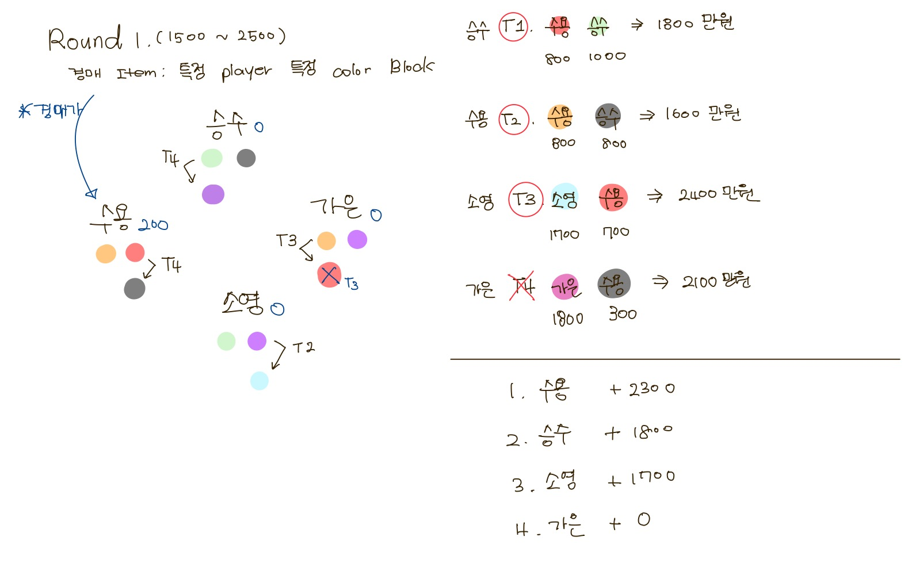
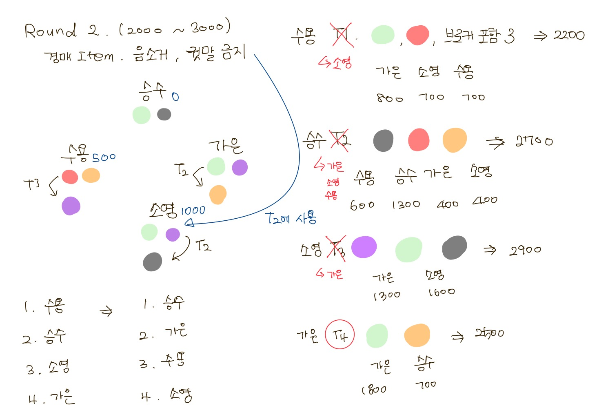
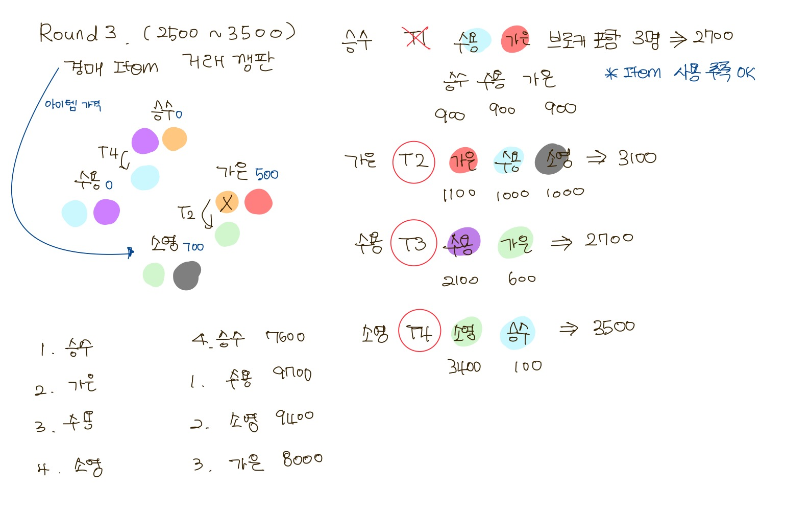
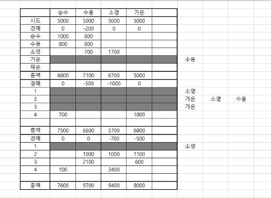

### 20220114

------

##### 오늘 할 일✔

- [x] **막**나가는 **장**사꾼 활용 툴 이야기 해보기
- [x] Sub PJT1 Week1 평가
- [x] Git Merge 충돌 익히기
- [x] **막**나가는 **장**사꾼 게임 규칙 정하기
- [x] **막**나가는 **장**사꾼 시뮬레이션 해보고 규칙 부족한 점 보완하기


##### 🎮 게임 규칙

+ Play인원 : 4~6명 

+ Seed Money : 5천만원 

+ 아이템 : 라운드마다 모든 Player는 기본 아이템으로 "지정색 변경권" 1개씩 갖게 되며, 매 라운드마다 특별한 아이템을 경매를 통해 구입 가능 (특별한 아이템들은 라운드가 지나도 비휘발성으로 다음 라운드까지 가져갈 수 있으며 단, 한 Player당 갖고 있을 수 있는 아이템은 기본 아이템 포함 최대 2개로 제한)

  특별 아이템의 종류 👉 한 Player 색 사용 금지, 음소거, 정보 새로 가져오기

+ 아이템 경매 금액 : 배팅 금액이 이루어지는 최대, 최소가 정해지며 해당 범위 내에서 랜덤으로 금액 정해짐

+ 각 라운드 별 아이템 경매 횟수 : 1번? 👉 2번이상까지도 생각해보기

+ 각 Turn별 시간 제한 : 3분

+ Trun 거래 조건 : 각 Player가 갖고 있는 색(or 능력) 내에서 제시

+  거래가 만약 체결되지 않았다면 해당 거래를 파토낸 Player가 돈을 잃거나 혼자 돈을 얻기 or 브로커가 기본 수당 받기


##### 💰 막나가는 장사꾼 시뮬레이션 진행

+  거래 조건 추가 : 브로커 포함 O명/브로커 제외 O명, 빨강 + 파랑 + 노랑or보라의 형식
+ 아이템 최대 경매 가격을 제한 👉 경매 가격 범위가 넓지 않아도 충분히 게임의 재미에는 영향❌

+ 아이템 경매 시 제시된 최고 경매 금액이 겹칠 경우 겹치지 않은 그 다음으로 높은 경매 금액을 제시한 Player가 아이템을 갖게 됨
+ 아이템 경매 시 제시된 경매 금액이 1000, 1000, 0, 0와 같이 모든 Player의 경매금액이 겹친다면 모두 아이템을 가질 수 없음
+ 모든 Player가 경매금액을 0을 제시한 경우에도 모두 아이템을 가질 수 없음
+ 게임을 진행하는 동안 귓속말 기능이 게임에 재미를 업 시켜주므로 귓속말 기능은 구현하기


##### 😋 시뮬레이션 결과

 👉 Round 1



👉 Round 2




👉 Round 3



👉 게임 결과




##### 📁 일과이후 할 일 

+ 👀눈치게임 🧠두뇌싸움이 일어날 수 있는 게임 조건 더 생각해보기


✏ 오늘의 느낀점

```
오늘 오전에 Firebase에 대한 강의를 듣고 공통 PJT 첫 평가를 했다.
우리 팀원들 모두 프로젝트에 열심히 참여하여 누구 한 명만을 매우 우수로 주기 너무 어려웠다.
오후부터는 게임 규칙을 정하고 정한 규칙들이 게임을 Play 하는데에 어떤 문제점이 있을지 직접 우리끼리 시뮬레이션을 해보는 시간을 가졌다.
직접 Player가 되어 해보니 정한 규칙들이 애매하거나, 예상하지 못했던 경우에 어떻게 게임이 진행되어야 하는지 생각하지 못했던 부분이 있었다.
게임 규칙들을 완전히 정하지는 못했지만 지금까지 정한 규칙들로도 충분히 게임을 진행할 수 있을 만큼은 정한 후 각자 더 생각해보기로 하고 마무리 지었다.
오늘은 다같이 게임을 시뮬레이션 해보며 프로젝트도 재미있게 진행하고 팀원들과도 더욱 친해질 수 있는 시간을 보냈다. 오늘 하루는 시간이 너무 빨리 간 것 같다.
```


