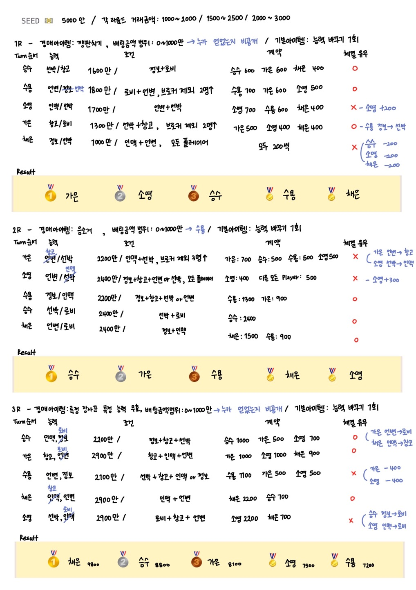
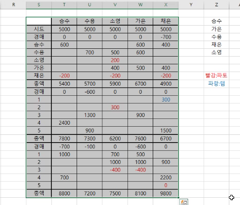
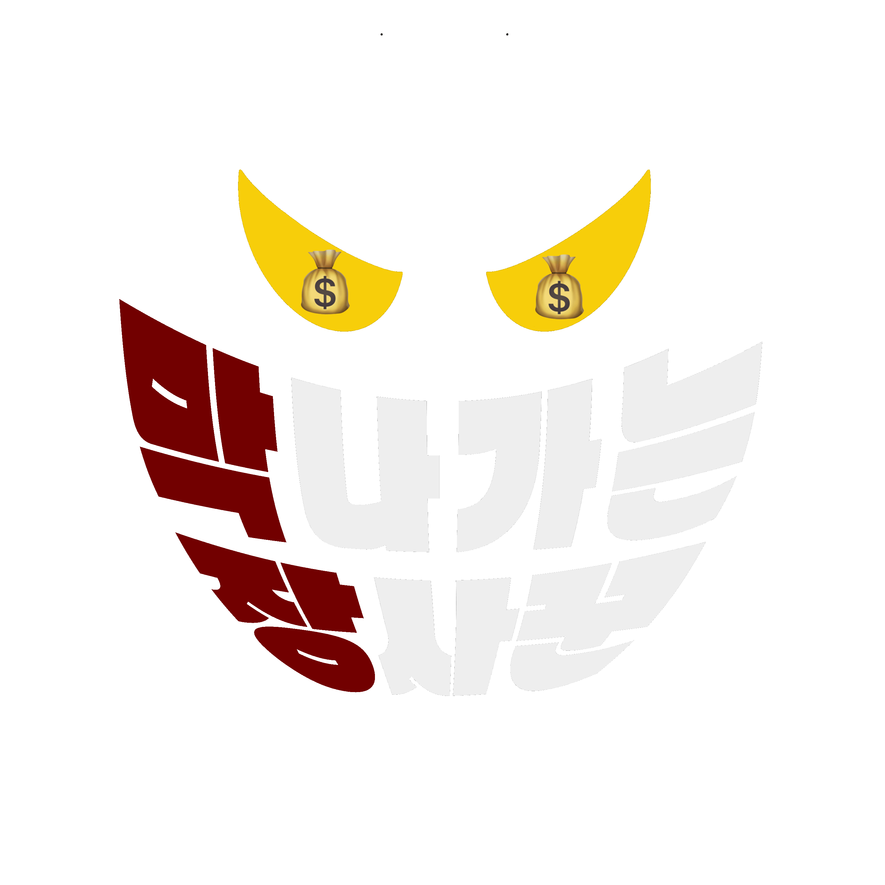
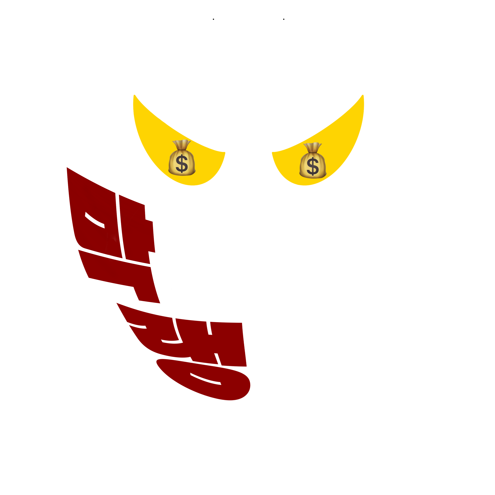

### 20220117

------

##### 오늘 할 일✔

- [x] **막**나가는 **장**사꾼 활용 툴 이야기 해보기
- [x] 바뀐 룰 적용해서 게임 시뮬레이션 해보기
- [x] **막**나가는 **장**사꾼 로고 생각해보기
- [x] Git, Jira 다시 만들기
- [x] Git, Jira 실습코치님 강의 청강
- [x]  (Front) 와이어프레임 - 메인페이지 제작


##### **막**나가는 **장**사꾼 활용 툴 💻

+ (Front) Vue.js , Vuex, Typescript 👉 Vue3 사용
+ (Back) Spring Boot

+ (DB) MariaDB
+ WebRTC
+ Firebase 👉 Firebase를 사용했을 때 속도가 느릴 수 있고, 대규모일 경우 서비스를 구현하는데에 불편할 수 있으므로 조금 더 생각해보기


##### 바뀐 룰 적용해서 게임 시뮬레이션 해보기 🎮





​																	(나는야 프로파토러 😋 )

+ 능력의 가시성을 위해 각 능력별 색을 달리하여 구분하기
+ 거래 참여 인원에 상관없이 거래를 파토낸 사람이 1명일 경우 파토낸 사람만 각 라운드에 해당하는 금액을 얻고, 2명 이상일 경우 파토내 인원 모두 각 라운드에 해당하는 금액만큼 차감 👉 1R : 200, 2R : 300, 3R: 400
+ 해당 Turn 차례인 Player가 거래 조건을 모두 갖고 있을 시 독점을 하게 되면 게임의 점수 격차가 너무 벌어짐 👉 독점 불가하도록 구현하기
+ 각 거래에 참여하는 인원의 최소, 최대 명시하기
+ 모든 Player에 대한 조건은 확률 낮추기


##### 게임 로고 (미정) 🎨






##### 일과이후 할 일 📁

+ 메인페이지 와이어프레임 제작하기


##### 오늘의 느낀점 ✏

```
게임 규칙을 조금 더 밸런스를 맞추고 아이템 및 조건들을 달리하면서 게임을 진행해보았다.
직접 여러가지 상황에서 해보니 문제점을 찾고 어느 것이 더 게임의 재미 요소를 더할 수 있을지 생각해보는 시간을 가질 수 있었다.
쉬는 시간에는 틈틈이 게임 로고를 생각해보며 프로크리에이트를 이용하여 로고를 제작하였다. GIF파일로 제작하여 움직이는 로고를 제작할 수 있었다.
오후 및 일과 이후에는 Front 담당자들끼리 모여 메인페이지 와이어프레임을 제작해보기로 하고 오늘  9 to 6 프로젝트 시간을 마무리했다. 와이어프레임을 제작하다보니 프로젝트의 구현 가능성을 더 생각해보게 되는 시간이 되었다.
```

