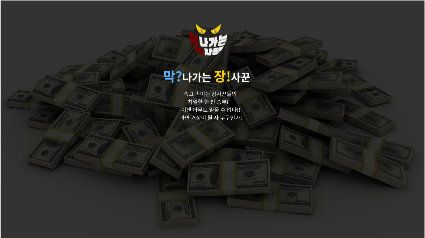
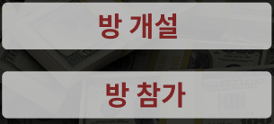

### 20220119

------

##### 오늘 할 일 ✔

- [x] RNR 정하기
- [x] Merge Request 승인 관련 회의
- [ ] API 설계서 작성
- [x] 2차 목업 작업
- [x] 메인페이지 Component 생각해보기 


##### RNR (Role & Responsibility) ✨

+ 프로젝트 수행 시 역할과 책임소재를 말하는 것

+ 전체 팀장 👉 한채은

+ PM 👉 이가은

+ 게임밸런스 👉 김수용

+ 배포담당 👉 김주호

+ 프론트엔드 팀장 👉 이소영 

+ 백엔드 팀장 👉 김승수


##### Merge Request 승인 💬

👉 특정 인원을 몇명 정해서 Merge Request 승인하는 것은 프리미엄 기능으로 사용 불가


##### 2차 목업 작업 🎨

+  호스트 외에 다른 사용자들이 호스트의 초대링크를 받아 참여할 시 초대코드 입력 후 방 입장

+  게임 대기중에는 테이블에 초대코드 띄우기 (참여자 모두 다른 사용자들을 초대할 수 있도록)

+ 게임 대기 시 참여인원이 4명미만일 경우 테이블에 있는 게임시작 버튼 비활성화

+ 게임 대기 시 참여인원이 4명이상일 경우 테이블에 있는 게임시작 버튼 활성화

+ 게임 최대 인원이 모두 차고 다른 사용자가 더 들어오려 시도하면 인원이 모두 찼다는 팝업창 뜨기

+ 게임 도중 Player가 게임을 나갈시 게임은 바로 중단되고 새로 시작해야함


##### 메인페이지 Component 💻






##### Jira 관련 Assign ✨

+ Front-end Assignee : 이소영

+ Back-end Assignee : 김승수


##### 일과이후 할 일 📁

+ 메인페이지 만들어보며 Vue 익히기
+ Typescript 학습


##### 오늘의 느낀점 ✏

```tex
어제 정하지 못한 RNR에 대해서 이야기를 나누어 보고 서로 역할을 정했다. 하나의 역할을 맡으니 프로젝트에 책임감이 더 생겨 프로젝트에 열심히 참여해야겠다는 생각이 들었다. 또한, Front와 Back이 함께 모여 회의를 할 때 Front 담당에서 나온 의견이나 해결방안 등을 잘 전달해야해서 팀원들의 의견들을 더 귀기울여 듣고 메모하게 되었다.
오늘 다같이 회의를 하다보니 1차 목업 과정에서 미처 생각지 못했던 부분들에 대해 더 이야기가 나와 2차 목업을 진행하게 되었다. 생각했던 것보다 하나의 서비스를 구현하는데에 세세한 부분까지 더 생각해야 한다는 것을 깨닫게 되었다. 그리고 평소에 아무렇지 않게 이용했던 게임페이지들을 하나씩 살펴보며 이 페이지를 만들기 위해 개발자들이 수많은 수정을 거쳤을 것을 생각하니 기능 하나하나가 너무 신기했다.
목업 작업 이후에는 페이지 구현을 위해 각 페이지 Component 구성에 대해 각자의 의견을 나누어 보는 시간을 가졌다. 그리고 마무리를 하며 그동안 배웠던 Vue 복습과 동시에 페이지를 구현해보고자 내일은 메인페이지를 함께 만들어보기로 하였다.
사실 아직 프로젝트 개발도 진행이 안되었고 주로 회의를 많이 했지만 프로젝트 하는 시간 내내 우리팀 분위기가 너무 좋아서 오늘도 하루가 빨리 지나간 것 같다. 개발을 하면서도 우리팀 모두 이런 좋은 분위기 속에서 프로젝트를 진행했으면 좋을것 같다.😋
```

