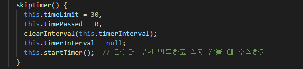

### 20220204

------

##### 오늘의 할일 ✔

- [x] 플레이어 비디오 검토
- [x] 타이머 에러 수정
- [ ] 능력 컴포넌트 제작
- [ ] 능력 컴포넌트 구현

###  

###  

###### 플레이어 비디오 검토 📺

| Todo                                        | Check                | Problem                                                      |
| ------------------------------------------- | -------------------- | ------------------------------------------------------------ |
| 원하는 위치에 userVideo 띄우기              | :white_check_mark:   |                                                              |
| 플레이어가 나갔을때 userVideo 송출 잘되는지 | :white_large_square: | 플레이어가 나갔을 때 플레이어의 참여아이디가 남고 같은 캠을 이용해서 방에 두번이상 동시에 들어오게 되면 한쪽만 비디오가 잘나오다가 두 영상 모두 끊김 |
| userVideo 크기 조정                         | :white_large_square: | userVideo 크키 조정하기 전 상위의 div박스 어떻게 처리할지 이야기 하기 |

###  

###  

##### 타이머 에러 수정 :alarm_clock:

👉 기존 : 정해진 시간이 끝나도 타이머가 멈추지 않고 -가 됨


👉 변경 

​	:one: GameStartInfo.vue의 methods에 skipTimer() 함수 추가 구현



​	:two: GameStartInfo.vue의 computed에 timeLeft() 함수 수정  => this.timeLimit - this.timePassed = 0일때(주어진 시간이 끝났을때) 앞서 구현한 skipTimer()함수  실행 


👉 변경 이후 : 정해진 시간이 끝나면 타이머가 다시 처음 정했던 시간(30초)으로 돌아가서 자동으로 타이머 재실행

👉 					만약, 타이머를 무한반복없이 끝내고 싶다면 skipTimer()함수에서 this.startTimer(); 실행문 없애기


###  

###  

##### 능력 컴포넌트 제작 및 구현 👑

-  STOMP나 Redis 없이 각 사용자에게 능력을 부여하고자 하여 random하게 능력을 줘보았다.

  👉 문제점

  ​    :one: 해당 페이지를 보는 사람마다 각 플레이어에게 부여된 능력들이 다르게 보임

  ​    :two: 해당 페이지를 새로고침할 경우 라운드가 끝나지 않아도 각 플레이어의 능력이 달라질 가능성이 있음

###  

###  

##### 일과 이후 할일 (주말 포함) 🗂

- STOMP 학습하기
- Redis 학습하기
- 각 플레이어의 능력 컴포넌트 구현

###  

###  

##### 오늘의 느낀점 ✏

```
어제 일과이후 끝난줄 알았던 오늘 각 플레이어의 비디오 송출을 오늘 팀원들과 함께 테스트 해본 결과 도중에 한 플레이어가 나가거나 동시에 같은 캠으로 접속한다면 나갔던 플레이어의 참여자 번호만 남거나 캠이 보이지 않는 일이 발생하였다. 이를 해결하고자 하였지만 어느 부분이 문제가 되는지 찾지 못했다.

후에는 채은님이 만들어오신 타이머를 GameMain.vue에 적용해보는 시간을 가졌다. 그런데 타이머가 멈추지 않고 계속 숫자가 작아져 -의 단위까지도 가는 문제점이 있었다. 그래서 위에 GamStratInfo.vue의 timeLeft()함수 수정과 skipTimer()함수를 추가함으로써 이를 해결하였고 아직 게임을 시작하거나 끝날때를 알려줄 수 있는 데이터를 받아오지 못했기 때문에 정해진 시간이 끝나면 다시 처음으로 돌아가 타이머가 자동으로 재실행되도록 수정하였다.

마지막으로 각 플레이어의 비디오 밑에 띄울 능력 컴포넌트를 제작 및 구현하는 시간을 가졌다. 구현하는 중 STOMP나 Redis 사용법을 아직 익히지 못해 컴포넌트로만 해결하고자 하였다. 그러나 해당 페이지를 보는 플레이어마다 각 플레이어에게 부여된 능력들이 다르게 보이고 해당 페이지를 새로고침할 경우 라운드가 끝나지 않아도 각 플레이어의 능력이 달라질 가능성이 있다는 문제점이 발견되었다. 해당 문제점은 주말을 포함한 일과 이후에 더 구글링을 해보며 해결할 예정이다.

오늘 뭔가 하루종일 컴퓨터를 붙잡고 있었지만 정작 필요한 기능은 많이 구현하지 못한것 같아 너무 아쉬웠다. 주말동안 STOMP와 Redis에 대해 더 공부해보고 다음주 프로젝트 진행시 원하는 기능을 다 구현하고 배포를 진행할 수 있도록 노력해야겠다.
```


