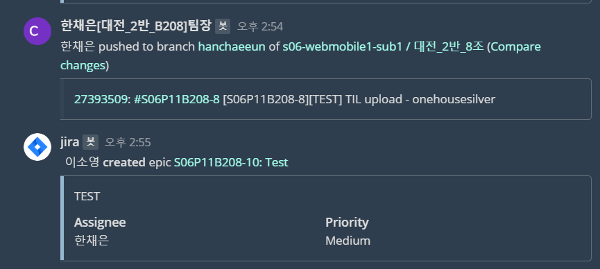

# 1월 11일 ✨

### 오늘의 목표 🎯

> 오늘 해야할 일을 간단하게 정리합니다.

- [x] 용어 정리
- [x] 환경세팅 완료하기
- [x] Jira, git 익히기

###  오늘의 회의 💡

> 오늘 어떤 회의를 했는지 간단하게 정리합니다.

- 게임 테마에 대해 용어를 정리해놓자

- 논의하여 버전정리 후 환경세팅을 완료하자

- Jira, git을 어떻게 사용할지 논의해보자

  

### 오늘의 해결 💡

> 오늘 어떤 일을 했는지 간단하게 정리합니다.

- 게임 용어 정리

  - 테마에 맞춰 게임을 진행 할 때 필요한 용어를 정리합니다.

  - 노션에 정리 완료!

- 환경세팅 완료

  - BE, FE 나눠서 환경 세팅을 하고 서로 쓸 버전을 확인하면서 세팅합니다.
  - 각자 맞춰서 세팅을 완료하고 어떤 이슈가 있었는지 확인했습니다.
  - 이슈는 팀원들끼리 논의해보고 안되는 경우에 코치님, 컨설턴트님께 물어보면서 해결해갔습니다.

- JIRA, GIT MM연동시키기
  - 서로 어떤 내용을 올렸는지 알람을 통해 확인 할 수 있습니다.

- JIRA, GIT 사용방법
  - 오후 실습코치님의 안내를 듣고 어떤식으로 진행할건지 결정하기로 했습니다.
