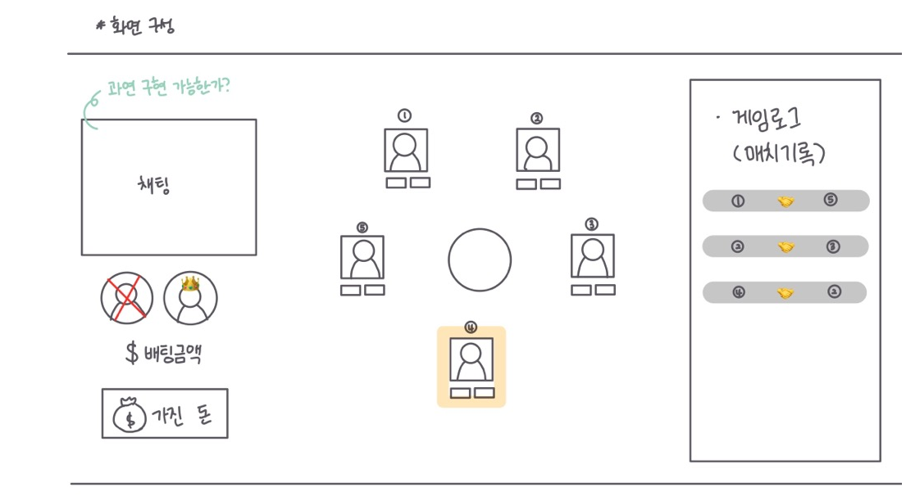
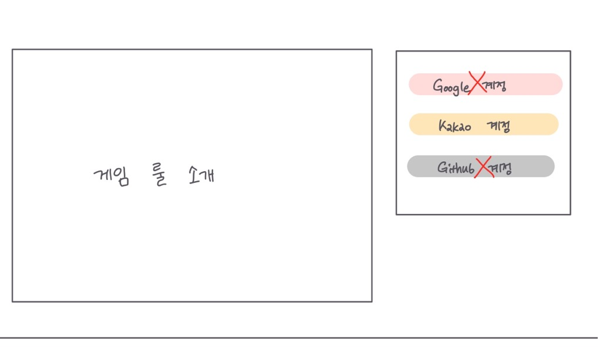
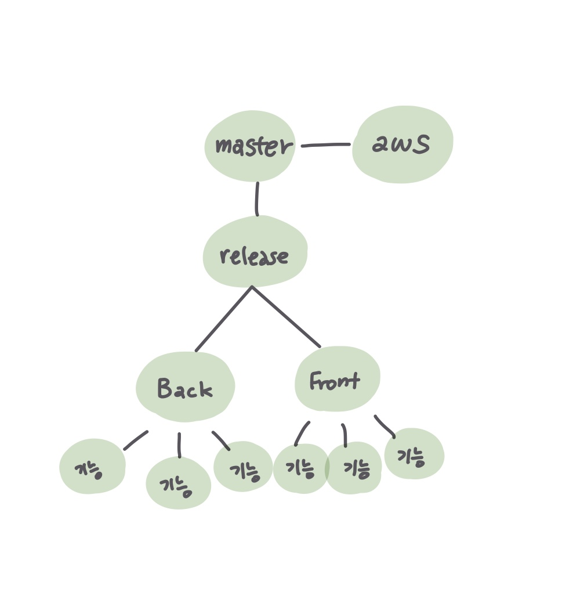

# 1월 12일 ✨

### 오늘의 목표 🎯

> 오늘 해야할 일을 간단하게 정리합니다.

- [x] git branch, git flow 전략 짜기
- [x] 와이어프레임 간략하게 논의하기
- [x] Jira 익히기
- [x] git commit-msg 사용법 익히기

###  오늘의 회의 💡

> 오늘 어떤 회의를 했는지 간단하게 정리합니다.

- 어떻게 화면을 구상할지 와이어프레임을 짜보자

- git branch 전략은 어떻게? flow는?

- Jira에 대해 공부하고 git-commit-msg 을 정하자

  

### 오늘의 해결 💡

> 오늘 어떤 일을 했는지 간단하게 정리합니다.

- 와이어프레임
  - 
  - 

- git branch, flow

  - BE, FE 나누고 각 기능별로 정리하기로 결정
  - 
- Jira에 대해 공부
  - Jira를 현업에서 사용이 가능할정도로!
  - 각자 공부하고, 디코나 mm을 통해 정보 공유하기
- git commit msg
  - FEAT : 새로운 기능의 추가
  - FIX: 버그 수정
  - DOCS: 문서 수정
  - STYLE: 스타일 관련 기능(코드 포맷팅, 세미콜론 누락, 코드 자체의 변경이 없는 경우)
  - REFACTOR: 코드 리펙토링
  - TEST: 테스트 코트, 리펙토링 테스트 코드 추가
  - CHORE: 빌드 업무 수정, 패키지 매니저 수정(ex .gitignore 수정 같은 경우)

