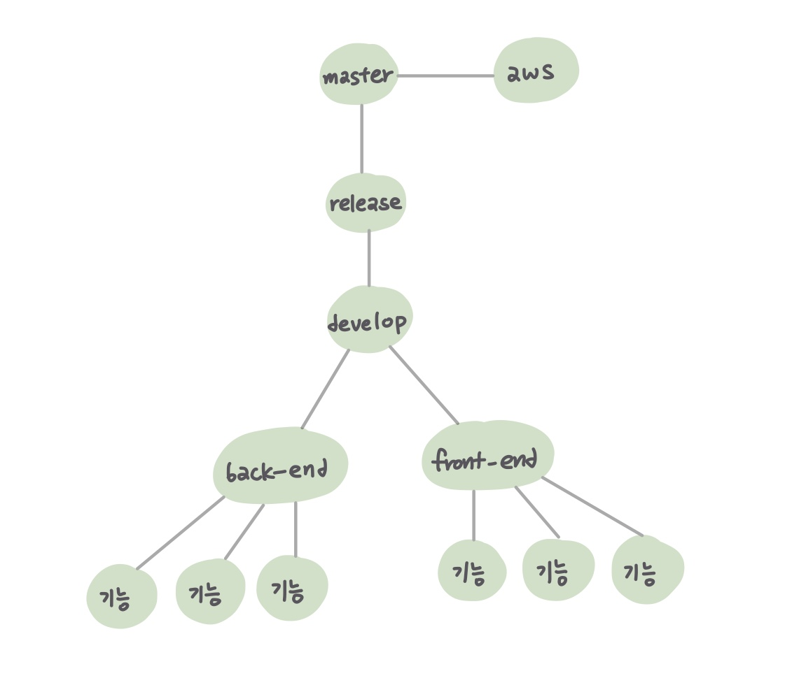

# 1월 13일 ✨

### 오늘의 목표 🎯

> 오늘 해야할 일을 간단하게 정리합니다.

- [x] git branch 나누기
- [x] 명세 뜯어보기
- [x] Source Tree 사용해보기
- [ ] ERD
- [ ] 화면구성
- [ ] 명세서 작성하기
- [ ] 세부 규칙 더 정하기
- [x] 

###  오늘의 회의 💡

> 오늘 어떤 회의를 했는지 간단하게 정리합니다.

- git branch를 정확하게 나눠놓자

- branch나눈걸 기반으로 어떻게 merge하는지 실습해보자

- Source Tree 배워보자 (수용님의 설명)

- ERD는 좀 더 생각해보고 나중에 정하자

- 화면 구성을 어떻게 할건지 기능 정리를 해보자

- 명세서 초안을 잡아보자

- 게임의 규칙을 좀 더 보완해보자

- 명세를 확인해보면서 어떤 방향으로 흘러가야할지 생각해보자

  

### 오늘의 해결 💡

> 오늘 어떤 일을 했는지 간단하게 정리합니다.

#### 오전

- git flow를 수정해서 git branch를 생성하였습니다.

  

++기존 flow에서 `develop` 추가

- 새로운 `TEST` 레포를 만들어서 실제 어떤 경우에 `merge-request 충돌`이 나는지에 대해 공부해봤습니다.
  - 다른 개발자가 수정한 내역이 있는경우 `100%` 충돌 :boom:이 난다!
- Source-Tree를 사용해보는 시간을 가졌습니다.
  - 수용님이 사용법을 아시고 계셔서 다들 따라하는 방식으로 진행
  - 한명씩 모두 설치완료, push, mr충돌까지 완료!
  -  소스트리랑 깃이랑 다른 파일! 따로 관리!

#### 오후

- mr충돌이 난걸 고치지 못해 계속 검색하고 팀원들끼리 논의
  - 수용님의 해결방법
    - 자기브랜치에서 수정해서 커밋
    - 내가 올릴 브랜치로 쳌아웃해서 머지하면 충돌
    - 이걸 로컬에서 해결 후 푸쉬
    - 충돌난거 해결했다고 커밋하고 브랜치에 업데이트
- 각자 명세를 읽고 프/백으로 나누어 어떻게 할건지 논의했습니다.
  - 프론트
    - Vue Cli로 갈지, Vuex로 갈지
    - 타입스크립트를 쓸지, 자바스크립트를 쓸지 등
      - 타입스크립트는 자바스크립트랑 비슷하지만 다른!
      - 자바스크립를 타입으로 돌리는거! 변수를 확실하게 해주는!

