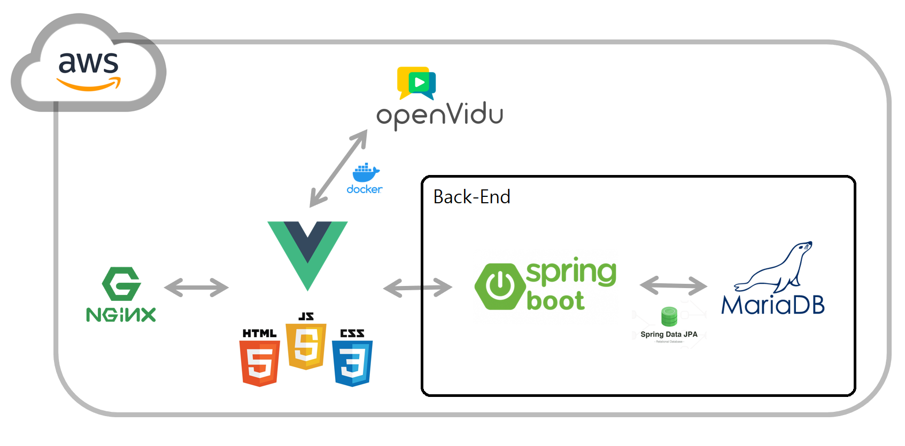
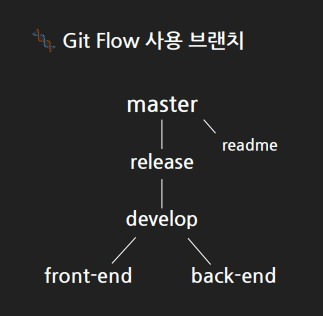

## 막나가는 장사꾼

---

### 백엔드 최종 정리

### 프로젝트 개요

- 진행 기간 - 22.01.10 ~ 22.02.18 (6주)
- 목표 - WebRTC를 활용한 서비스 구현 및 배포

### 프로젝트 소개 <막나가는 장사꾼>

온라인으로 보드게임을 즐길 수 있는 **화상 기반 웹 게임 서비스**

실제 보드게임을 기반으로 비대면 환경에 맞는 게임을 제작하여 서비스하고자 함

>  게임 규칙 - [~~초기 룰북~~](README.assets/막나가는_장사꾼_룰북.md), [최종 룰북]()

### 기술 스택

- SpringBoot
  - 자바 기반 웹 어플리케이션을 위한 프레임워크 Spring을 자동화
  - MVC 패턴과 DI 개념에 따른 프로젝트 구조를 마련
- MariaDB
  - 관계형 데이터베이스 관리 시스템(RDMS) 오픈 소스
  - User 테이블의 속성을 정의하고 저장
- JPA
  - 자바 지속성 API, 관계형 데이터베이스의 관리를 표현
  - 기본적인 CRUD 구문을 통해 MariaDB를 조작하여 데이터 처리

### API

- 유저 관리 (/account)
  - 소셜 로그인 API를 통해 가입한 사용자의 DB 관리

- 채팅 (/pub/chat)
  - 서버 단에서 방 정보를 관리하여 사용자 간 전체 채팅 및 귓속말 구현

- 게임 (/game)
  - 게임 생성 - 방 정보를 통해 GameDTO를 생성하고 roomId로 이를 관리
  - 거래 제안 - DealDTO를 통한 프론트엔드 ↔ 백엔드의 데이터 전송으로 거래 제안 구현
  - 투표 & 투표 결과 - 각 사용자의 투표 여부 및 투표 결과 데이터를 일부 숨기며 데이터 전송

### 프로젝트 구조(백엔드)

- 서버
  - Controller - 프론트로부터 요청을 받는 웹 MVC의 컨트롤러
    - UserController, StompChatController, GameController
  - Service - 핵심 비즈니스 로직을 실제 수행
  
    - UserService, GameService, AsyncService
  - Repository - DB, DTO 등에 직접 접근하며 데이터 작업을 수행
  
    - UserRepository, RoomMap, GameMap
  - Domain, DTO - 서비스 관련 데이터를 담고 전달되는 객체
  
    - User, Player, ChatMessageDTO, ChatRoomDTO, GameDTO, DealDTO
  
  
  
- DB
  - 프로젝트 특성 등을 고려해 DB에 저장할 정보는 User 테이블 하나로 설계
  - User 테이블
    - userId : 회원번호
    - nickName : 닉네임
    - email : 이메일
    - rankPoint : 랭크 점수
    - winAmount : 우승 횟수
    - gangAmount : 깽판 횟수
    - proGangAmount : 프로깽판러 횟수

### 깃 브랜치 전략

>  

- develop > release > master로 이어지는 병합 요청은 항상 책임자와 함께 처리
- front-end와 back-end 브랜치 각각 기능별로 새 브랜치를 체크아웃하여 분업하는 방식 활용
- 각 팀원의 TIL을 정리하는 readme 브랜치는 따로 관리

### 팀원 소개 및 역할(백엔드)

김승수 : **BE 팀장**. BE관련 전체 책임자 역할. 팀장 부재시 부팀장으로 역할을 수행

> - AWS 서버 구축
> - 게임 시스템 구현
> - OpenVidu를 통한 WebRTC 활용

김수용 : **BE**. BE 팀장과 함께 게임 서비스 전체를 관리. 또한 게임 룰이나 컨텐츠에 대한 부분을 관리

> - RESTful API 설계
> - STOMP를 활용한 채팅 시스템 구현
> - 게임 시스템 구현

김주호 : **FS**. 전반적인 코드 컴포넌트를 관리하고 배포를 관리

> - 네이버, 카카오 로그인 API 활용
> - FE 프로젝트 구조 설계
> - 배포 관리

### 고찰

설계/코드/소감

- 설계
  - 프로젝트 기간 예측 실패
  - mvc 패턴을 제대로 지키지 못함
  - 경매, 아이템, 상점 기능 삭제
  - 스프링 IoC / DI의 부적절한 활용
- 코드
  - stomp 귓속말 구현 방법
  - Redis 캐시 서비스
  - JUnit을 활용한 테스트
  - 쓰레드 활용 방식 - 이거 되는 거 맞아?
  - 코드 스멜 분석 결과 - 보안 문제
- 소감
  - Git 브랜치 규정이 아쉬움
  - 다함께 FE 구현에 집중했던 이야기
